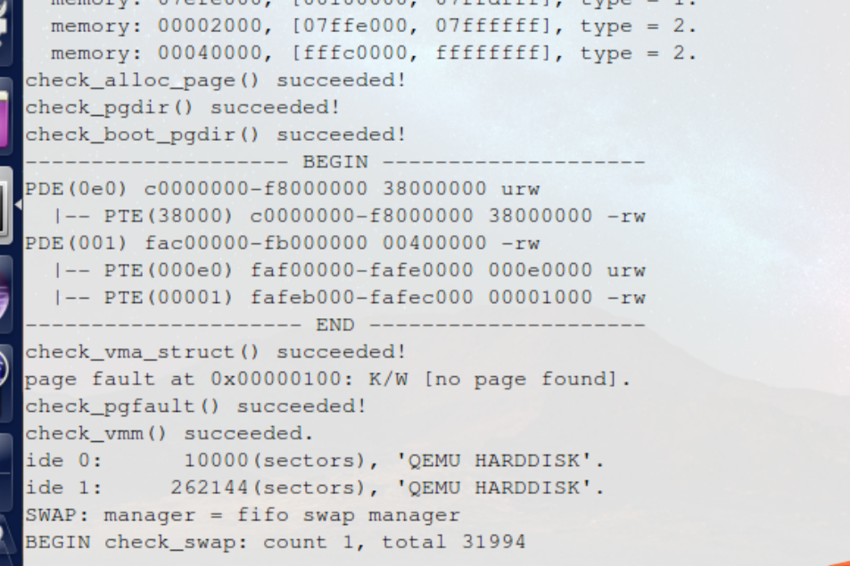
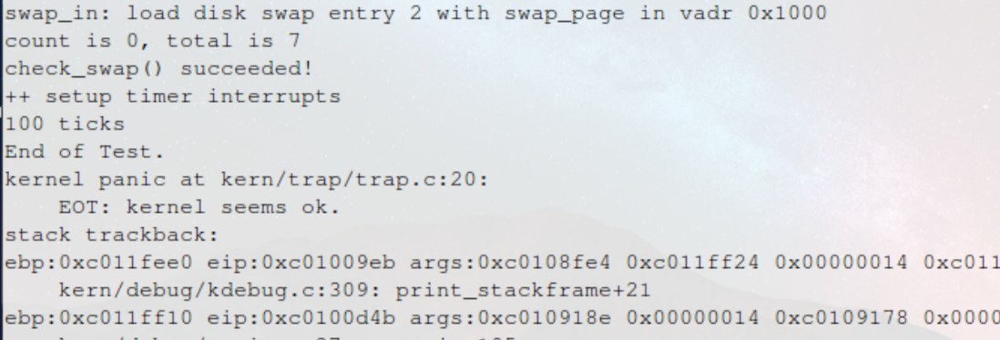

计64	嵇天颖	2016010308

## LAB 3

[TOC]

---

### 练习0：填写已有实验

> 本实验依赖实验1/2。请把你做的实验1/2的代码填入本实验中代码中有“LAB1”,“LAB2”的注释相应部分。

利用`diff/merge`工具实现代码的合并。

---

### 练习1：给未被映射的地址映射上物理页

#### 【练习1.1】

> 完成`do_pgfault（mm/vmm.c）`函数，给未被映射的地址映射上物理页。设置访问权限 的时候需要参考页面所在 `VMA `的权限，同时需要注意映射物理页时需要操作内存控制 结构所指定的页表，而不是内核的页表。

##### 设计原理分析

（1）某一些虚拟内存的空间是合法的，但尚未给它们分配具体的内存页。如果我们访问这些虚拟内存页的时候，就会发生`page fault`异常。

（2）我们利用`page fault`异常，让操作系统在进行异常处理的时候对这些合法的虚拟内存页分配相应的物理内存页。这样我们从中断返回的时候就能进行正常的内存访问。

（3）`page fault`处理流程：`trap_dispatch`函数会根据`page fault`的中断号，将它交给`pgfault_handler`函数，从而进一步交给`do_pgfault`函数进行处理。

##### 设计思路

（1）检查页表中是否有相应的表项，如果表项为空，则说明没有映射过；

* 使用在`lab2`中实现的函数`get_pte`来获取线性地址所对应的虚拟页的起始地址对应到的页表项。
* 如果查询到的`PTE`不为0，则表示对应的物理页可能在内存中或者在外存中，否则就表示对应的物理页尚未被分配，

（2）为没有映射的虚拟页分配一个物理页，并确认分到的物理页不为空。

* `pgdir_alloc_page`函数实现了内存分配功能，我们用这个函数来获取对应的物理页，并且将其与当前的虚拟页设置上映射关系，我们以此来为未被映射的地址映射上物理页。

##### 代码实现

根据注释的提示，我们在`do_pgfault`中补全下面的代码：

首先获取发生缺页错误的`PTE` ，如果`PTE`为0, 说明虚页不存在, 则使用`pgdir_alloc_page`分配。

~~~c
//(1) try to find a pte, if pte's PT(Page Table) isn't existed, then create a PT.
if ((ptep = get_pte(mm->pgdir, addr, 1)) == NULL) {
    cprintf("get_pte in do_pgfault failed\n");
    return ret;
}
//(2) if the phy addr isn't exist, then alloc a page & map the phy addr with logical addr.
if (*ptep == 0) {
    if (pgdir_alloc_page(mm->pgdir, addr, perm) == NULL) {
        cprintf("pgdir_alloc_page in do_pgfault failed\n");
        return ret;
    }
}
~~~

#### 【练习1.2】

> 请描述页目录项（`Page Directory Entry`）和页表项（`Page Table Entry`）中组成部分对`ucore`实现页替换算法的潜在用处。

（1）首先我们观察并了解页目录项和页表项的组成部分和其作用：

页目录项和页表项的组成结构是相同的，区别在于高20位存储的内容不同。

页目录项存储的是二级页表的物理页帧号，而页表项存储的是虚拟地址对应的页帧号。

| 位    | 说明                       |                                  |
| ----- | -------------------------- | -------------------------------- |
| 31-12 | 页表页帧号                 |                                  |
| 11-9  | PTE_AVAIL                  | 保留专供程序使用，处理器不会修改 |
| 8-7   | PTE_MBZ，Bits must be zero |                                  |
| 6     | PTE_D，Dirty               | 页面是否被修改过                 |
| 5     | PTE_A，Accessed            | 页面是否被访问过                 |
| 4     | PTE_PCD，Cache-Disable     | 是否禁用Cache                    |
| 3     | PTE_PWT，Write-Through     | 是否采用写直达                   |
| 2     | PTE_U, User can access     | 超级用户标志位                   |
| 1     | PTE_W, Writeable           | 页面是否可读写                   |
| 0     | PTE_P, Present             | 指明表项对地址转换是否有效       |

（2）下面我们分析页目录项和页表项的组成部分对页替换算法的用处：

* 页目录项（`pgdir`）作为一个双向链表存储了目前所有的页的物理地址和逻辑地址的对应，即在实内存中的所有页，替换算法中被换出的页从`pgdir`中选出。

* 页表（`pte`）则存储了替换算法中被换入的页的信息，替换后会将其映射到一物理地址。
* 表项中`PTE_A`表示内存页是否被访问过，`PTE_D`表示内存页是否被修改过，这两个标志位可以成为局部页替换算法选取换出页的依据。

#### 【练习1.3】

> 如果`ucore`的缺页服务例程在执行过程中访问内存，出现了页访问异常，请问硬件要做哪些事情？

（1）**进入中断处理**

CPU在执行完一个指令后开始读取中断信号，获取到中断index及相应的error code信息等；接下来，CPU会将相应的error code及寄存器状态等存储在trapframe中，并根据异常对应向量值去IDT中寻找中断描述符。

中断描述符中存储着中断例程对应的`selector`和`offse`t，通过这两个值将`CS：EIP`定位到中断服务例程上，也就是我们的`do_pgfault`上进行后续处理。

之后，`CPU`会根据`CPL`和`DPL`确认是否发生了特权级的转换。然后保存现场，开始执行中断服务例程。

（2）**缺页异常处理**

发生缺页异常时，中断服务例程会将缺失的页调入到内存中，有些情况下会进行页置换。根据情况修改页表。

（3）**完成中断处理**

每个中断服务例程在有中断处理工作完成后需要通过`iret`（或`iretd`）指令恢复被打断的程序的执行。恢复现场保存信息，并完成特权级的转换。回到出现异常的语句继续执行。

---

### 练习2：补充完成基于FIFO的页面替换算法

#### 【练习2.1】

> 完成`vmm.c`中的`do_pgfault`函数，并且在实现`FIFO`算法的`swap_fifo.c`中完成`map_swappable`和`swap_out_victim`函数。通过对`swap`的测试。

##### 设计思路与原理分析

（1）先进先出算法：该算法总是淘汰最先进入内存的页。把一个应用程序在执行过程中已调入内存的页按先后次序链接成一个队列，队列头执行内存中驻留时间最久的页，队列尾指向最近被调入内存的页。

（2）并非所有的物理页都可以交换出去，只有映射到用户空间且被用户程序直接访问的页面才能被交换，而被内核直接使用的内核空间的页面不能被换出。

（3）我们的设计思路如下：

- 判断当前是否对交换机制进行了正确的初始化；
- 将虚拟页对应的物理页从外存中换入内存；
- 给换入的物理页和虚拟页建立映射关系；
- 将换入的物理页设置为允许被换出。

##### 步骤分析与代码实现

（1）在练习1中我们知道，如果`pte`的值为0（这表示无效，即没有对应的物理页面），则分配一个物理页面。

如果不是`0`，由于这里已经进入了`do_pgfault`处理流程，那么产生缺页错误的原因只可能是页面不在内存中而在磁盘上，我们需要从磁盘中调入相应的页面。

`swap_in`函数定义在`swap.c`中，将根据`mm`和`addr`来获取`pte`（同样使用`get_pte`函数），然后根据`pte`中的内容去磁盘中调入该页面，存放在新分配的一个物理`Page`中（传入的`page`参数就更新为这个新分配的物理页面）。然后`page_insert`会建立该虚拟地址到物理页面的映射（修改页表）。最后标记该`page`为`swappable`。

~~~c
else{
        if(swap_init_ok) {
            struct Page *page=NULL;
            //(1）According to the mm AND addr, try to load the content of right disk page
            //    into the memory which page managed.
            swap_in(mm, addr, &page);
            page_insert(mm->pgdir, page, addr, perm); 
            //(3) make the page swappable.
            swap_map_swappable(mm, addr, page, 1);
            page->pra_vaddr = addr;
        }else {
            cprintf("no swap_init_ok but ptep is %x, failed\n",*ptep);
            return ret;
        }
    }
~~~

（2）由于`FIFO`基于双向链表实现，所以只需要将元素插入到头节点之前。

在`_fifo_map_swappable`函数中根据注释添加如下代码，将最近访问过的页面添加到链表的头部，即插入到`head`的后面，就成为链表的第一个。

~~~c
//(1)link the most recent arrival page at the back of the pra_list_head qeueue.
list_add(head, entry);
~~~

（3）`_fifo_swap_out_victim`中需要选出一个作为换出，这里取出的是链表的尾部，由于这里是双向链表,我们使用`head->prev`来获取。下面的`le`就是要换出的那个`Page`。然后从链表中将`le`删除掉。

~~~c
//(1)  unlink the  earliest arrival page in front of pra_list_head qeueue
list_entry_t *le = head->prev;
assert(head!=le);
struct Page *p = le2page(le, pra_page_link);
list_del(le);
assert(p !=NULL);
//(2)  assign the value of *ptr_page to the addr of this page
*ptr_page = p;
~~~

#### 【练习2.2】

##### 【练习2.2.1】

> 如果要在`ucore`上实现"`extended clock`页替换算法"请给你的设计方案，现有的`swap_manager`框架是否足以支持在`ucore`中实现此算法？如果是，请给你的设计方案。如果不是，请给出你的新的扩展和基此扩展的设计方案。

**结论**：现有框架基础上可以支持`Extended Clock`算法

**改进的时钟页替换算法**：我们知道时钟替换算法是一个类似`LRU`的实现，淘汰一个页面只考虑页面是否被访问过。但实际情况中，我们还应该考虑被淘汰的页面是否被修改过，因为淘汰修改过的页面还需要写回硬盘，置换代价太大。改进的时钟置换算法除了考虑页面的访问情况，还需考虑页面的修改情况。即该算法不但希望淘汰的页面是最近未使用的页，而且还希望被淘汰的页是在主存驻留期间其页面内容未被修改过的。

**设计方案**：

（1）**利用PTE组成部分**：`PTE`中包含了`dirty`位和`access`位，因此可以确定某一个虚拟页是否被访问过以及写过。

（2）**拓展物理页的描述信息**：物理页的描述信息`Page`结构中默认只包括了一个对应的虚拟页的地址，应当采用链表的方式，在`Page`中扩充一个成员，把物理页对应的所有虚拟页都给保存下来；而物理页的`dirty`位和访问位均为只需要某一个对应的虚拟页对应位被置成`1`即可置成`1`。

（3）**算法实现**：我们考虑对`FIFO`算法的框架进行修改得到拓展时钟算法的框架，由于这两种算法都是将所有可以换出的物理页面均按照进入内存的顺序连成一个环形链表，因此初始化，将某个页面置为可以/不可以换出这些函数均不需要进行大的修改(小的修改包括在初始化当前指针等)，唯一需要进行重写的函数是选择换出物理页的函数`swap_out_victim`。

（4）**函数`swap_out_vitcim`**: 

当该页被访问时，`CPU`中的`MMU`硬件将把访问位置`“1”`。当该页被`“写”`时，CPU中的`MMU`硬件将把修改位置`“1”`。这样这两位(`access`,`dirty`)就存在四种可能的组合情况：

* `（0，0）`表示最近未被引用也未被修改，首先选择此页淘汰；
* `（0，1）`最近未被使用，但被修改，其次选择；
* `（1，0）`最近使用而未修改，再次选择；
* `（1，1）`最近使用且修改，最后选择。

（5）**函数map_swappable**:
读取`TLB`，将访问位更新，即被访问过的页的访问位`++`，清零`TLB`上的该标记。
根据时钟算法，顺着循环链表搜索和修改相应的标志位，直到找到合适的页，返回该页。

##### 【练习2.2.2】

> 需要被换出的页的特征是什么？

对于每个页面都有两个标志位，分别为使用位和修改位。换出页的使用位必须为0，表示该页在之前一段时间未被使用。并且算法优先考虑换出修改位为零的页面，以免频繁地将内存中的物理页写入磁盘而增大开销。

> 在ucore中如何判断具有这样特征的页？

`PTE`中包含了`dirty`位和`access`位，因此可以确定某一个虚拟页是否被访问过以及写过。

当该页被访问时，`CPU`中的`MMU`硬件将把访问位置`“1”`。当该页被`“写”`时，CPU中的`MMU`硬件将把修改位置`“1”`。

> 何时进行换入和换出操作？

（1）当进程访问的物理页没有在内存中缓存而是保存在磁盘中时(产生`page fault`的时候)，需要进行换入操作； 

（2）换出操作源于在算法中将物理页的`dirty`从1修改成0的时候，因此这个时候如果不进行写出到外存，就会造成数据的不一致。因此当位于物理页中的内存被页面替换算法选择换出时，需要进行换出操作。

​	换出页面的时机相对复杂一些，针对不同的策略有不同的时机。`ucore`目前大致有两种策略，即积极换出策略和消极换出策略。积极换出策略是指操作系统周期性地（或在系统不忙的时候）主动把某些认为“不常用”的页换出到硬盘上，从而确保系统中总有一定数量的空闲页存在，这样当需要空闲页时，基本上能够及时满足需求；消极换出策略是指，只是当试图得到空闲页时，发现当前没有空闲的物理页可供分配，这时才开始查找“不常用”页面，并把一个或多个这样的页换出到硬盘上。

---

### 实验结果

**make qemu**

（1）执行`make qemu`，观察是否通过检测：

`check_alloc_page`,`check_pgdir`,`check_boot_pgdir`,`check_vma_struct`,`check_pgfault`,`check_vmm`均通过

`check_swap`同样也通过测试，同时能正确输出`100 ticks`

**make grade**

（2）执行`make grade`得到的结果为：

通过`make grade`测试

---

### 与参考答案实现的区别

根据题目所提示的注释来写的步骤，实现上一些语句的顺序和细节上可能有所不同，但是整体思路是类似的。

---

### 实验中的涉及到的重要知识点

#### （1）虚拟内存管理

**注意点**

1. 虚拟内存单元不一定有实际的物理内存单元对应，即实际的物理内存单元可能不存在；
2. 如果虚拟内存单元对应有实际的物理内存单元，那二者的地址一般是不相等的；
3. 通过操作系统实现的某种内存映射可建立虚拟内存与物理内存的对应关系，使得程序员或`CPU`访问的虚拟内存地址会自动转换为一个物理内存地址。

**按需分页**

通过内存地址虚拟化，可以使得软件在没有访问某虚拟内存地址时不分配具体的物理内存，而只有在实际访问某虚拟内存地址时，操作系统再动态地分配物理内存，建立虚拟内存到物理内存的页映射关系，这种技术称为按需分页（`demand paging`）。

**页换入换出**

把不经常访问的数据所占的内存空间临时写到硬盘上，这样可以腾出更多的空闲内存空间给经常访问的数据；当`CPU`访问到不经常访问的数据时，再把这些数据从硬盘读入到内存中，这种技术称为页换入换出（`page swap in/out`）。

页换入换出机制可以保证更多的程序在内存中并发运行。

#### （2）页面置换机制

**页置换算法**

（1）先进先出(`FIFO`)页替换算法：

* 该算法总是淘汰最先进入内存的页，即选择在内存中驻留时间最久的页予以淘汰。
* `FIFO`算法只是在应用程序按现行顺序访问地址空间时效果才好，否则效率不高。因为那些常被访问的页，往往在内存中也停留的最久，却不得不被置换出去。
* 异常现象（`Belady`现象）：在增加放置页的页帧的情况下，反而使得页访问异常次数增多。

（2）时钟(`Clock`)页替换算法：

* 是`LRU`算法的一种近似实现。时钟页替换算法把各个页面组织成环形链表的形式，类似于一个钟的表面。然后把一个指针（简称当前指针）指向最老的那个页面，即最先进来的那个页面。

* 时钟算法需要在页表项（`PTE`）中设置了一位访问位来表示此页表项对应的页当前是否被访问过。当该页被访问时，`CPU`中的`MMU`硬件将把访问位置`“1”`。

（3）改进的时钟（`Enhanced Clock`）页替换算法：

* 与时钟页替换算法相比，淘汰一个页面时还考虑了页面是否被访问过。
* 设置了访问位和修改位来表征状态，最优先淘汰的是未访问未修改的页。
* 该算法与时钟算法相比，可进一步减少磁盘的I/O操作次数，但为了查找到一个尽可能合适淘汰的页面，可能需要经过多次扫描，增加了算法本身的开销。

**可以被换出的页**

并非所有的物理页都可以交换出去的，只有映射到用户空间且被用户程序直接访问的页面才能被交换，而被内核直接使用的内核空间的页面不能被换出。

### 实验中未涉及的知识点列举

（1）局部页面置换算法中的：最优算法，最近最久未使用算法，最不常用算法等。

（2）全局页面置换算法

* 置换页面的选择范围是所有可换出的物理页面
* 工作集算法，缺页率算法

（3）抖动问题：操作系统需要在并发水平和缺页率之间达到一个平衡，选择一个适当的进程数目和进程需要的物理页面数。

