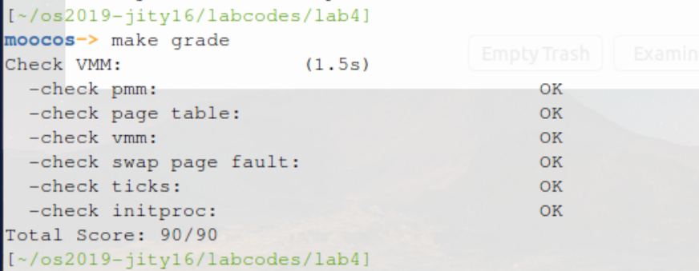

计64	嵇天颖	2016010308

## LAB 4

[TOC]

---

### 练习0：填写已有实验

> 本实验依赖实验1/2/3。请把你做的实验1/2/3的代码填入本实验中代码中有“LAB1”,“LAB2”，“LAB3"的注释相应部分。

利用`diff/merge`工具实现代码的合并。

---

### 练习1：分配并初始化一个进程控制块

#### 【练习1.1】

> `alloc_proc`函数（位于`kern/process/proc.c`中）负责分配并返回一个新的`struct proc_struct`结构，用于存储新建立的内核线程的管理信息。`ucore`需要对这个结构进行最基本的初始化，你需要完成这个初始化过程。

##### 进程控制块数据结构分析

进程管理信息用`struct proc_struct`表示，在`kern/process/proc.h`中表示如下：

~~~c
struct proc_struct {
    enum proc_state state;                      // Process state
    int pid;                                    // Process ID
    int runs;                                   // the running times of Proces
    uintptr_t kstack;                           // Process kernel stack
    volatile bool need_resched;                 // bool value: need to be rescheduled to release CPU?
    struct proc_struct *parent;                 // the parent process
    struct mm_struct *mm;                       // Process's memory management field
    struct context context;                     // Switch here to run process
    struct trapframe *tf;                       // Trap frame for current interrupt
    uintptr_t cr3;                              // CR3 register: the base addr of Page Directroy Table(PDT)
    uint32_t flags;                             // Process flag
    char name[PROC_NAME_LEN + 1];               // Process name
    list_entry_t list_link;                     // Process link list 
    list_entry_t hash_link;                     // Process hash list
};
~~~

我们对进程控制块中的成员变量作解释：

* `state`:进程所处的状态
* `mm`:内存管理的信息，包括内存映射列表，页表指针等
* `parent`:用户进程的父进程（创建它的进程）
* `context`:进程的上下文，用于进程切换
* `tf`:中断帧的指针，总是指向内核栈的某个位置
* `cr3`:保存页表的物理地址，目的就是进程切换的时候方便直接使用`lcr3`实现页表切换
* `kstack`:每个线程都有一个内核栈，并且位于内核地址空间的不同位置

##### 代码实现和原理分析

我们利用`uCore`通过给当前执行的上下文分配一个一个进程控制块以及对它进行相应的初始化，从而创建第0个内核线程`idleproc`。我们创建第0个内核线程的时候，首先调用了`alloc_proc`函数来通过`kmalloc`函数来获得`proc_struct`结构的一块内存块，作为第0个进程控制块。

**（1）实现方法：**把`proc`初始化（把`porc_struct`中各个成员变量清零，有一些变量要设置特殊值）

**（2）原理分析**：

我们来分析一下有特殊值和一些比较重要的成员变量的初始化

* `proc_state`表示了进程所处的状态，我们观察`proc.h`中定义的进程生命周期内的状态：

  ~~~c
  // process's state in his life cycle
  enum proc_state {
      PROC_UNINIT = 0,  // uninitialized
      PROC_SLEEPING,    // sleeping
      PROC_RUNNABLE,    // runnable(maybe running)
      PROC_ZOMBIE,      // almost dead, and wait parent proc to reclaim his resource
  };
  ~~~

  我们发现定义了`uninitialized`,`sleepling`,`runnable`,`zombie`四个状态，我们初始化时需要`PROC_UNINIT`状态

  ~~~c
  proc->state = PROC_UNINIT;
  ~~~

* 设置进程的`pid`为`-1`，表示进程的`process id`尚未办好

  ~~~c
   proc->pid = -1;
  ~~~

* `mm`数据结构是用来实现用户控件的虚存管理的，但是内核线程没有用户空间，它执行的只是内核中的一小段代码，所以它没有`mm`数据结构，也就是`NULL`

  ~~~c
  proc->mm = NULL;
  ~~~

* 在所有进程中，只有一个进程没有父进程，就是内核创建的第一个内核进程`idleproc`

  ~~~ c
  proc->parent = NULL;
  ~~~

* 当某个进程是一个普通用户态进程的时候，`PCB`中的`cr3`就是`mm`中页表的物理地址；而当它是内核线程的时候，`cr3`等于`boot_cr3`。而`boot_cr3`指向了`uCore`启动时建立好的内核虚拟空间的页目录表首地址

  ~~~c
  proc->cr3 = boot_cr3;
  ~~~

**（3）完整代码**

~~~c
proc->state = PROC_UNINIT;
proc->pid = -1;
proc->runs = 0;
proc->kstack = 0;
proc->need_resched = 0;
proc->parent = NULL;
proc->mm = NULL;
memset(&(proc->context), 0, sizeof(struct context));
proc->tf = NULL;
proc->cr3 = boot_cr3;
proc->flags = 0;
memset(proc->name, 0, PROC_NAME_LEN);
~~~

#### 【练习1.2】

> 请说明`proc_struct`中`struct context context`和`struct trapframe *tf`成员变量含义和在本实验中的作用是啥？

**（1）context含义和作用**:

进程的上下文，用于进程切换。在 `uCore`中，所有的进程在内核中也是相对独立的（例如独立的内核堆栈以及上下文等等）。使用 `context `保存寄存器的目的就在于在内核态中能够进行上下文之间的切换。实际利用`context`进行上下文切换的函数是在`kern/process/switch.S`中定义`switch_to`。

下面的注释解释了各寄存器的作用：

~~~c
struct context {
    uint32_t eip;	//指令寄存器
    uint32_t esp;	//堆栈指针寄存器
    uint32_t ebx;	//基址寄存器
    uint32_t ecx;	//计数器
    uint32_t edx;	//数据寄存器
    uint32_t esi;	//源地址指针寄存器
    uint32_t edi;	//目的地址指针寄存器
    uint32_t ebp;	//基址指针寄存器
};
~~~

我们发现在进程切换的时候保存了`eip,esp,ebx,ecx,edx,esi,edi,ebp`八个寄存器的值。我们发现它并没有对eax进行保存。我们注意到在进行切换的时候调用了`switch_to`这函数，也就是说这个函数里面才是线程之间切换的切换点，而在这个函数里面，由于`eax`是一个`caller-save`寄存器，并且在函数里`eax`的数值一直都可以在栈上找到对应，因此并不需对`%eax`进行保存。

**（2）trapframe含义和作用**

`tf`：中断帧的指针，总是指向内核栈的某个位置：当进程从用户空间跳到内核空间时，中断帧记录了进程在被中断前的状态。当内核需要跳回用户空间时，需要调整中断帧以恢复让进程继续执行的各寄存器值。除此之外，`uCore`内核允许嵌套中断。因此为了保证嵌套中断发生时`tf `总是能够指向当前`trapframe`，`uCore `在内核栈上维护了` tf `的链。

我们在进程切换的过程中，切换入口函数会将模拟一个中断返回，并将当前的`esp`定位在这个`trapframe`上，这样在处理完中断弹出后就可以直接从这个`trapframe`中恢复出进程真正的`esp`和`eip`，从而进程真正的程序运行；

进程切换的时候，一定会发生中断，进入内核态，故需要保存中断产生的栈帧的信息。`trapframe`结构体就是用来保存这些信息的，储存各段寄存器，以及发生中断时被硬件压栈的若干寄存器（`err，eip，cs，eflags，esp，ss`），表示当前中断产生的栈帧。

---

### 练习2：为新创建的内核线程分配资源

#### 【练习2.1】

> 创建一个内核线程需要分配和设置好很多资源。`kernel_thread`函数通过调用`do_fork`函数完成具体内核线程的创建工作。`do_kernel`函数会调用`alloc_proc`函数来分配并初始化一个进程控制块，但`alloc_proc`只是找到了一小块内存用以记录进程的必要信息，并没有实际分配这些资源。`ucore`一般通过`do_fork`实际创建新的内核线程。`do_fork`的作用是，创建当前内核线程的一个副本，它们的执行上下文、代码、数据都一样，但是存储位置不同。在这个过程中，需要给新内核线程分配资源，并且复制原进程的状态。你需要完成在`kern/process/proc.c`中的`do_fork`函数中的处理过程。

##### 原理和实现分析

`kernel_thread`函数采用了局部变量`tf`来放置保存内核线程的临时中断帧，并把中断帧的指针传递给`do_fork`函数，而`do_fork`函数会调用`copy_thread`函数来在新创建的进程内核栈上专门给进程的中断帧分配一块空间。

`do_fork`是创建线程的主要函数。`kernel_thread`函数通过调用`do_fork`函数最终完成了内核线程的创建工作。下面我们来分析一下`do_fork`函数的实现，`do_fork`函数主要做了以下事情：

1. 分配并初始化进程控制块（`alloc_proc`函数）；
2. 分配并初始化内核栈（`setup_stack`函数）；
3. 根据`clone_flag`标志复制或共享进程内存管理结构（`copy_mm`函数）；
4. 设置进程在内核（将来也包括用户态）正常运行和调度所需的中断帧和执行上下文（`copy_thread`函数）；
5. 把设置好的进程控制块放入`hash_list`和`proc_list`两个全局进程链表中；
6. 自此，进程已经准备好执行了，把进程状态设置为“就绪”态；
7. 设置返回码为子进程的`id`号。

##### 具体代码和步骤解释

我们根据平台提供的注释提示的步骤实现了如下的代码，下面的注释部分解释了每段代码的含义

~~~c
// 分配进程控制块（此时PCB还没有初始化）
proc = alloc_proc();
if (proc == NULL) {
  goto fork_out;
}
// 为PCB指定父进程
proc->parent = current;
// 分配两个页的内核栈空间给这个新的进程控制块
if (setup_kstack(proc) != 0) {
  goto bad_fork_cleanup_proc;
}
// 拷贝mm_struct，建立新进程的地址映射关系
if (copy_mm(clone_flags, proc) != 0) {
  goto bad_fork_cleanup_kstack;
}
// 拷贝父进程的trapframe，并为子进程设置返回值为0
copy_thread(proc, stack, tf);
// 中断可能由时钟产生，会使得调度器工作，为了避免产生错误，需要屏蔽中断
bool intr_flag;
local_intr_save(intr_flag);
{
  // 建立新的哈希链表
    proc->pid = get_pid();
    hash_proc(proc);
    list_add(&proc_list, &(proc->list_link));
    nr_process ++;
}
local_intr_restore(intr_flag);
// 唤醒进程，转为PROC_RUNNABLE状态
wakeup_proc(proc);
// 父进程应该返回子进程的pid
ret = proc->pid;
~~~

#### 【练习2.2】

> 请说明`ucore`是否做到给每个新`fork`的线程一个唯一的`id`？请说明你的分析和理由。

（1）`ucore`能做到给每个新`fork`的线程一个唯一的`id`

（2）`uCore`平台代码中通过`get_pid()`函数来实现分配唯一的`pid`：

* `last_pid`初始为1，`next_pid`设置为`MAX_PID`，这两个变量表示进程号序列的区间范围
* 遍历进程列表，执行以下操作：
  * 如果`pid == last_pid`，那么`last_pid++`
  * `pid`在`last_pid`和`next`之间，那么将`next = pid`
  * 如果`last_pid++`后比`next`大，那么将`next = MAX_PID`，`last_pid`不变，继续从头开始遍历

~~~c
// get_pid - alloc a unique pid for process
static int
get_pid(void) {
    static_assert(MAX_PID > MAX_PROCESS);
    struct proc_struct *proc;
    list_entry_t *list = &proc_list, *le;
    static int next_safe = MAX_PID, last_pid = MAX_PID;
    if (++ last_pid >= MAX_PID) {
        last_pid = 1;
        goto inside;
    }
    if (last_pid >= next_safe) {
    inside:
        next_safe = MAX_PID;
    repeat:
        le = list;
        while ((le = list_next(le)) != list) {
            proc = le2proc(le, list_link);
            if (proc->pid == last_pid) {
                if (++ last_pid >= next_safe) {
                    if (last_pid >= MAX_PID) {
                        last_pid = 1;
                    }
                    next_safe = MAX_PID;
                    goto repeat;
                }
            }
            else if (proc->pid > last_pid && next_safe > proc->pid) {
                next_safe = proc->pid;
            }
        }
    }
    return last_pid;
}
~~~

* 每次调用`get_pid`时，除了确定一个可以分配的`PID`外，还需要确定`next_safe`来实现均摊以此优化时间复杂度，`PID`的确定过程中会检查所有进程的`PID`来确保`PID`是唯一的。

---

### 练习3：理解 proc_run 函数和它调用的函数如何完成进程切换的

#### 【练习3.1】

> 请在实验报告中简要说明你对proc_run函数的分析。并回答如下问题：

我们首先观察`proc_run`的代码，在注释部分阐释了各部分代码的用处含义。

从代码中我们得知`proc_run`执行过程如下：

- 保存`IF`位并且禁止中断；
- 将`current`指针指向将要执行的进程；
- 更新`TSS`中的栈顶指针；
- 加载新的页表；
- 调用`switch_to`进行上下文切换；
- 当执行`proc_run`的进程恢复执行之后，需要恢复`IF`位。

~~~c
// proc_run - make process "proc" running on cpu
// NOTE: before call switch_to, should load  base addr of "proc"'s new PDT
void
proc_run(struct proc_struct *proc) {
    if (proc != current) {	// 判断需要运行的线程是否已经运行着了
        bool intr_flag;
        struct proc_struct *prev = current, *next = proc;
        local_intr_save(intr_flag); // 关闭中断
        {
            current = proc;
            load_esp0(next->kstack + KSTACKSIZE);	//设置TSS
            lcr3(next->cr3);	// 修改当前的cr3寄存器成需要运行线程（进程）的页目录表
            switch_to(&(prev->context), &(next->context));	//切换到新的线程
        }
        local_intr_restore(intr_flag);
    }
}
~~~

首先需要关闭中断，以免在进程切换的过程中产生新的中断发生新的切换操作。这里加载`esp0`寄存器为新的内核栈地址，将`cr3`设置为新的页目录地址，然后就进入`switch_to`执行。

我们再观察`switch_to`函数：进入`switch_to`之后，`esp`指向的是压入的返回地址，`esp+4`为第一个参数（`from`），`esp+8`为第二个参数（`to`）。然后把各个寄存器的值储存到`from`指向的地址处，即当前`proc`的`context`中，再将`to`指向的地址中保存的各寄存器的值恢复。之后`pushl 0(%eax)，eax`指向的位置存储的是`to`的`eip（eip`是`context`中的第一个变量），栈顶`（esp）`的位置就是要切换的进程的`eip`。`ret`指令会`pop`出栈顶的值并将这个值设置为当前的`eip`，于是就完成了进程的切换。

#### 【练习3.2】

> 在本实验的执行过程中，创建且运行了几个内核线程？

进入`proc_init`后，首先创建了一个名为`idle`的进程，并设置为当前进程。然后调用`kernel_thread`，里面调用`do_fork`，创建了一个新的进程，返回一个`pid`，并设置名字为`init`。可以知道`idle`的`pid`为`0`，`init`的`pid`为`1`。

我们通过`make qemu`输出的结果也可以得出：

~~~java
this initproc, pid = 1, name = "init"
To U: "Hello world!!".
To U: "en.., Bye, Bye. :)"
~~~

可以看到，我们运行了一个内核进程，`pid`为`1`，名为`init`。
我们总共创建了两个内核线程`idle`和`init`。

#### 【练习3.3】

> 语句`local_intr_save(intr_flag);....local_intr_restore(intr_flag);`在这里有何作用?请说明理由

在执行省略号部分的代码时关闭中断，执行完毕后再打开中断。作用是避免产生其他的陷入，例如产生另一个进程切换任务，这样会产生错误，因为省略号处代码的执行需要保证原子性。

> - 在本实验的执行过程中，创建且运行了几个内核线程？
> - 
> - 语句`local_intr_save(intr_flag);....local_intr_restore(intr_flag);`在这里有何作用?请说明理由

---

### 实验结果

（1）**make qemu**结果符合预期

（2）**make grade结果**

### 与参考答案的区别

按照平台提供的代码注释步骤来写，具体实现有差异，思路步骤无太大差异

---

### 实验中的涉及到的重要知识点

#### （1）进程控制块的结构
如果要让内核线程运行，我们首先要创建内核线程对应的进程控制块，还需把这些进程控制块通过链表连在一起，便于随时进行插入，删除和查找操作等进程管理事务。这个链表就是进程控制块链表。然后在通过调度器`（scheduler）`来让不同的内核线程在不同的时间段占用`CPU`执行，实现对`CPU`的分时共享。

实验中实现了进程控制块`PCB`的数据结构。在实验四中，进程管理信息用`struct proc_struct`表示，在`kern/process/proc.h`中定义

#### （2）创建进程的过程
建立进程控制块后，现在就可以通过进程控制块来创建具体的进程/线程了。首先，考虑最简单的内核线程，它通常只是内核中的一小段代码或者函数，没有自己的“专属”空间。这是由于在`uCore OS`启动后，已经对整个内核内存空间进行了管理，通过设置页表建立了内核虚拟空间（即`boot_cr3`指向的二级页表描述的空间）。所以`uCore OS`内核中的所有线程都不需要再建立各自的页表，只需共享这个内核虚拟空间就可以访问整个物理内存了。从这个角度看，内核线程被`uCore OS`内核这个大“内核进程”所管理。

**创建第0个内核线程`idleproc`**

首先当前的执行上下文（从`kern_init` 启动至今）就可以看成是`uCore`内核中的一个内核线程的上下文。为此，`uCore`通过给当前执行的上下文分配一个进程控制块以及对它进行相应初始化，将其打造成第0个内核线程 ` idleproc`。

**创建第1个内核线程`initproc`**

第0个内核线程主要工作是完成内核中各个子系统的初始化，然后就通过执行`cpu_idle`函数开始过退休生活了。所以`uCore`接下来还需创建其他进程来完成各种工作，但`idleproc`内核子线程自己不想做，于是就通过调用`kernel_thread`函数创建了一个内核线程`init_main`。在实验四中，这个子内核线程的工作就是输出一些字符串，然后就返回了。

#### （3）进程切换的过程

`uCore`在实验四中只实现了一个最简单的`FIFO`调度器，其核心就是`schedule`函数。它的执行逻辑很简单：

* 设置当前内核线程`current->need_resched`为`0`；
* 在`proc_list`队列中查找下一个处于“就绪”态的线程或进程`next`； 
* 找到这样的进程后，就调用`proc_run`函数，保存当前进程`current`的执行现场（进程上下文），恢复新进程的执行现场，完成进程切换。

---

###  实验中未对应的知识点
* 进程在不同状态之间转换时的操作

* 父子进程之间的关系

