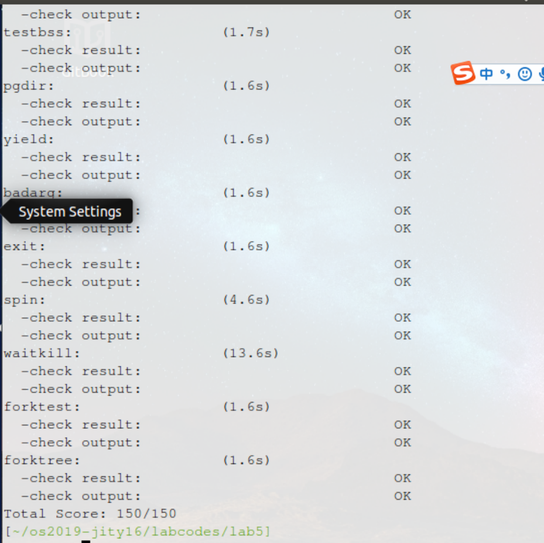

计64	嵇天颖	2016010308

## LAB 5

[TOC]

---

### 练习0：填写已有实验

> 本实验依赖实验1/2/3/4。请把你做的实验1/2/3/4的代码填入本实验中代码有“LAB1”,“LAB2”，“LAB3","LAB4"的注释相应部分。注意：为了能够正确执行lab5的测试应用程序，可能需对已完成的实验1/2/3/4的代码进行进一步改进。

#### LAB1 修改

（1）**增加功能**：为用户态设置中断向量表。

**原理**：在执行加载中断描述符表`lidt`指令前，专门设置了一个特殊的中断描述符`idt[T_SYSCALL]`，它的特权级设置为`DPL_USER`，中断向量处理地址在`_vectors[T_SYSCALL]`处。这样建立好这个中断描述符后，一旦用户进程执行`INT T_SYSCALL`后，由于此中断允许用户态进程产生（注意它的特权级设置为`DPL_USER`），所以`CPU`就会从用户态切换到内核态，保存相关寄存器，并跳转到`_vectors[T_SYSCALL]`处开始执行，

**代码**：在`idt_init`函数中添加如下代码(`T_SYSCALL`这个`trap`的特权级应当是`DPL_USER`)

~~~c
//let user app to use syscall to get the service of ucore
//so you should setup the syscall interrupt gate in here
SETGATE(idt[T_SYSCALL], 1, GD_KTEXT, __vectors[T_SYSCALL], DPL_USER);
~~~


（2）**增加功能**：需要更改对于时钟中断的处理。

在`trap_dispatch`函数中添加代码：当到时间片结束时需要将当前进程的`need_resched`设置为`1`，表示需要被切换的进程。

~~~c
/* you should upate you lab1 code (just add ONE or TWO lines of code):
         *    Every TICK_NUM cycle, you should set current process's current->need_resched = 1 */
ticks++;
if (ticks % TICK_NUM == 0) {
    //print_ticks();
    assert(current != NULL);
    current->need_resched = 1;
}
~~~


#### LAB4 修改

（1）函数`alloc_proc`增加对四个新增字段的初始化

在`lab5`中`PCB`增加了`wait_state, *cptr, *yptr, *optr`字段，需要在`alloc_proc`中实现它们的初始化

~~~c
proc->wait_state = 0;
proc->cptr = proc->optr = proc->yptr = NULL;
~~~

（2）更新`do_fork()`函数，调用`set_links()`函数取代原来的加入链表操作。

* 为了确保当前进程正在等待，增加如下断言

~~~c
assert(current->wait_state == 0); 
~~~

* 将原来简单的计数改成来执行`set_links`函数

~~~c
//list_add(&proc_list, &(proc->list_link));
//nr_process ++;
set_links(proc);
~~~


---


### 练习1: 加载应用程序并执行

#### 【练习1.1】

> `do_execv`函数调用`load_icode`（位于`kern/process/proc.c`中）来加载并解析一个处于内存中的ELF执行文件格式的应用程序，建立相应的用户内存空间来放置应用程序的代码段、数据段等，且要设置好`proc_struct`结构中的成员变量`trapframe`中的内容，确保在执行此进程后，能够从应用程序设定的起始执行地址开始执行。需设置正确的`trapframe`内容。
>
> 请在实验报告中简要说明你的设计实现过程。

**原理分析**

我们需要设置新创建用户进程的`trapframe`中的内容，以便该进程在从内核态中返回后，能够正确地在用户态执行。为了在`trap`返回时能够从内核态进入用户态，代码段寄存器`CS`必须要设置为`USER_CS`，`USER_CS`中对应设置的`DPL`为`3`（表示用户态）。这样在执行`iret`指令时，会发现当前特权级(0)小于将要`pop`出的`CS`的特权级(3)，说明要发生特权级的转换，因此会再`pop`出`SS`和`esp`。

然后就是将`DS，ES，SS`等都设置为`USER_DS`，将`esp`设置为`USTACKTOP`（即用户地址空间的栈顶），`eip`设置为加载的程序的入口地址。

**具体实现**

我们可以从注释中知道需要进行如下设置：

* `tf_cs`设置为用户态代码段的段选择子
* `tf_ds、tf_es、tf_ss`均设置为用户态数据段的段选择子
* `tf_esp`设置为用户栈的栈顶
* `tf_eip`设置为`ELF`文件的入口`e_entry`
* `tf_eflags`使能中断位

~~~c
tf->tf_cs = USER_CS;
tf->tf_ds = tf->tf_es = tf->tf_ss = USER_DS;
tf->tf_esp = USTACKTOP;
tf->tf_eip = elf->e_entry;
tf->tf_eflags = FL_IF; 
~~~


#### 【练习1.2】

> 请在实验报告中描述当创建一个用户态进程并加载了应用程序后，`CPU`是如何让这个应用程序最终在用户态执行起来的。即这个用户态进程被`ucore`选择占用CPU执行（`RUNNING`态）到具体执行应用程序第一条指令的整个经过。

在确定了用户进程的执行代码和数据，以及用户进程的虚拟空间布局后，我们可以来创建用户进程。

加载应用程序的函数`do_execve`是由`syscall.c`中的函数`sys_exec`调用的，`sys_exec`实际上是一个系统调用。

（1）`uCore`通过`do_execve`函数来完成用户进程的创建工作:

- 首先为加载新的执行码做好用户态内存空间清空准备。
- 接下来的一步是加载应用程序执行码到当前进程的新创建的用户态虚拟空间中。

这里我们会涉及到读`ELF`格式的文件，申请内存空间，建立用户态虚存空间，加载应用程序执行码等。`load_icode`函数完成了整个复杂的工作。`do_execve`函数调用`load_icode`函数后会设置当前进程的`trapframe`。


（2）`load_icode`函数的主要工作就是给用户进程建立一个能够让用户进程正常运行的用户环境。

* 调用`mm_create`函数来申请进程的内存管理数据结构`mm`所需内存空间，并对`mm`进行初始化；
* 调用`setup_pgdir`来申请一个页目录表所需的一个页大小的内存空间，将`ucore`内核虚空间映射的内核页表的内容拷贝到此新目录表中，让`mm->pgdir`指向此页目录表
* 根据应用程序执行码的起始位置来解析此ELF格式的执行程序,表明用户进程的合法用户态虚拟地址空间
* 调用根据执行程序各个段的大小分配物理内存空间，并根据执行程序各个段的起始位置确定虚拟地址，并在页表中建立好物理地址和虚拟地址的映射关系，然后把执行程序各个段的内容拷贝到相应的内核虚拟地址中
* 需要给用户进程设置用户栈，明确用户栈的位置在用户虚空间的顶端，并分配一定数量的物理内存且建立好栈的虚地址<-->物理地址映射关系
* 更新用户进程的虚拟内存空间
* 先清空进程的中断帧，再重新设置进程的中断帧


（3）在`do_execve`函数退出后，顺次返回到`syscall`函数，`trap_dispatch`函数，`trap`函数，最后退回到`trapentry.S`中的`__alltraps`中的`"call trap"`的下一条指令。调用`trap``函数之后，传入的参数trapframe`的内容已经被修改了，也就是说此时栈中的内容就是在`load_icode`函数中设置的`trapframe`。


（4）用户进程的用户环境已经搭建完毕。此时`initproc`将按产生系统调用的函数调用路径原路返回，执行中断返回指令`iret`（位于`trapentry.S`的最后一句）后，将切换到用户进程的第一条语句位置（根据`tf_eip`的值）开始执行。`iret`指令执行时，会依次`pop eip，CS，EFLAGS`，然后判断`CS`中的特权级标识。由于我们之前设置的`CS`为`USER_CS`，那么`CPU`会知道我们需要从内核态返回用户态，因此还会`pop`出`SS`和`esp`。由于`SS`和`esp`指向的是用户态地址空间，另外`trapframe`中的`eip`还被设置为了加载的程序的`entry`地址，因此在`iret`返回之后，就会在用户态开始运行被加载的程序。


---

### 练习2: 父进程复制自己的内存空间给子进程

#### 【练习2.1】

> 创建子进程的函数`do_fork`在执行中将拷贝当前进程（即父进程）的用户内存地址空间中的合法内容到新进程中（子进程），完成内存资源的复制。具体是通过`copy_range`函数（位于`kern/mm/pmm.c`中）实现的，请补充`copy_range`的实现，确保能够正确执行。

**原理分析**

（1）函数调用关系为：

~~~c
do_fork --> copy_mm --> dup_mmap --> dup_mmap --> copy_range
~~~

（2）此时`ucore`运行在内核态中，且处于保护模式，因此不能直接对物理地址进行操作，而是需要把物理地址转换为内核虚地址后再进行操作。物理地址到内核虚地址的转换参见`pmm.h`的`KADDR`宏定义：

```
#define KADDR(pa) ({                                                    \
    uintptr_t __m_pa = (pa);                                    \
    size_t __m_ppn = PPN(__m_pa);                               \
    if (__m_ppn >= npage) {                                     \
    panic("KADDR called with invalid pa %08lx", __m_pa);    \
    }                                                           \
    (void *) (__m_pa + KERNBASE);                               \
})
```

可以看到内核虚地址就是将物理地址加上`KERNBASE（0xC0000000）`。

然后就可以对得到的内核虚地址进行内存的操作，这里使用`memcpy`函数完成页的复制。

最后在页表中为新分配的页建立虚拟地址和物理地址的映射关系。


**实现代码和步骤**

我们需要实现原进程页到新进程页的数据拷贝，根据平台提供的步骤，我们实现代码如下：

~~~c
//获取父进程的虚拟页地址
void * kva_src = page2kva(page);
//获取子进程的虚拟页地址
void * kva_dst = page2kva(npage);
//拷贝父进程到子进程
memcpy(kva_dst, kva_src, PGSIZE);
//设置页表的映射关系
ret = page_insert(to, npage, start, perm);
~~~


#### 【练习2.2】

> 请在实验报告中简要说明如何设计实现`”Copy on Write 机制“`，给出概要设计，鼓励给出详细设计。

`“Copy on Write”`机制需要在执行`do_folk`函数的时候不新分配物理页面并将原进程页面中的内容拷贝至新分配的物理页面，而是拷贝原来进程的整个页表，并把所有页面的权限都设置为只读。

这样的话，新创建的进程实际上共享了原进程的物理内存。如果新进程对某个页面进行写操作，由于页面的权限都是只读，就会产生一个`page fault`，我们就可以在`do_pgfault`中检测到这个问题，并分配新的物理页面，重新建立页表，进行数据拷贝，异常处理返回之后新进程就可以在新分配的物理页面进行写操作而不影响原来进程的数据了。

除此之外，我们还需要区分是由于`“Copy on Write”`机制触发的`page fault`还是由于正常向只读页面进行写操作触发的`page fault`。因此，需要将页表项中的保留位设置为应对这种情况的标志位。


---


### 练习3：理解进程执行 fork/exec/wait/exit 的实现，以及系统调用的实现

#### 【练习3.1】

> 请在实验报告中简要说明你对 fork/exec/wait/exit函数的分析。

（1）**`fork`函数分析**

- 通过`alloc_proc()`分配并初始化进程控制块；
- 通过`setup_stack()`分配并初始化内核栈；
- 复制或共享进程内存管理结构；
- 设置进程中断帧和执行上下文；
- 把设置好的进程控制块放入`hash_list`和`proc_list`两个全局进程链表中；
- 将进程状态设置为“就绪”态；
- 设置返回码为子进程的`id`号。

（2）**`exec`函数分析**

* 首先为加载新的执行码做好用户态内存空间清空准备。
* 如果`mm`不为`NULL`，则设置页表为内核空间页表，且进一步判断`mm`的引用计数减`1`后是否为`0`，如果为`0`，则表明没有进程再需要此进程所占用的内存空间，为此将根据`mm`中的记录，释放进程所占用户空间内存和进程页表本身所占空间。
* 最后把当前进程的`mm`内存管理指针为空。由于此处的`initproc`是内核线程，所以`mm`为`NULL`，整个处理都不会做。

（3）**`wait`函数分析**

父进程执行`wait`用户函数或`wait_pid`用户函数来回收子进程，这两个函数的区别是，`wait`函数等待任意子进程的结束通知，而`wait_pid`函数等待进程`id`号为`pid`的子进程结束通知。这两个函数最终访问`sys_wait`系统调用接口让`ucore`来完成对子进程的最后回收工作，即回收子进程的内核栈和进程控制块所占内存空间，具体流程如下：

* 如果`pid!=0`，表示只找一个进程`id`号为`pid`的退出状态的子进程，否则找任意一个处于退出状态的子进程；

* 如果此子进程的执行状态不为`PROC_ZOMBIE`，表明此子进程还没有退出，则当前进程只好设置自己的执行状态为`PROC_SLEEPING`，睡眠原因为`WT_CHILD`（即等待子进程退出），调用`schedule()`函数选择新的进程执行，自己睡眠等待，如果被唤醒，则重复跳回步骤1处执行；
* 如果此子进程的执行状态为`PROC_ZOMBIE`，表明此子进程处于退出状态，需要当前进程（即子进程的父进程）完成对子进程的最终回收工作，即首先把子进程控制块从两个进程队列`proc_list`和`hash_list`中删除，并释放子进程的内核堆栈和进程控制块。自此，子进程才彻底地结束了它的执行过程，消除了它所占用的所有资源。

（4）**`exit`函数分析**

用户态的函数库中提供了`exit`函数，此函数最终访问`sys_exit`系统调用接口让操作系统来帮助当前进程执行退出过程中的部分资源回收。

首先，`exit`函数会把一个退出码`error_code`传递给`ucore`，`ucore`通过执行内核函数`do_exit`来完成对当前进程的退出处理，主要工作简单地说就是回收当前进程所占的大部分内存资源，并通知父进程完成最后的回收工作，具体流程如下：

* 如果`current->mm != NULL`，表示是用户进程，则开始回收此用户进程所占用的用户态虚拟内存空间；
  * 首先执行`“lcr3(boot_cr3)”`，切换到内核态的页表上，这样当前用户进程目前只能在内核虚拟地址空间执行了，这是为了确保后续释放用户态内存和进程页表的工作能够正常执行；
  *  如果当前进程控制块的成员变量`mm`的成员变量`mm_count`减1后为0（表明这个`mm`没有再被其他进程共享，可以彻底释放进程所占的用户虚拟空间了。），则开始回收用户进程所占的内存资源：
    * 调用`exit_mmap`函数释放`current->mm->vma`链表中每个`vma`描述的进程合法空间中实际分配的内存，然后把对应的页表项内容清空，最后还把页表所占用的空间释放并把对应的页目录表项清空；
    * 调用`put_pgdir`函数释放当前进程的页目录所占的内存；
    * 调用`mm_destroy`函数释放`mm`中的`vma`所占内存，最后释放`mm`所占内存；

* 此时设置`current->mm`为`NULL`，表示与当前进程相关的用户虚拟内存空间和对应的内存管理成员变量所占的内核虚拟内存空间已经回收完毕；

* 这时，设置当前进程的执行状态`current->state=PROC_ZOMBIE`，当前进程的退出码`current->exit_code=error_code`。此时当前进程已经不能被调度了，需要此进程的父进程来做最后的回收工作（即回收描述此进程的内核栈和进程控制块）；

* 如果当前进程的父进程`current->parent`处于等待子进程状态：

`current->parent->wait_state==WT_CHILD，`

则唤醒父进程（即执行`“wakup_proc(current->parent)”`），让父进程帮助自己完成最后的资源回收；

* 如果当前进程还有子进程，则需要把这些子进程的父进程指针设置为内核线程`initproc`，且各个子进程指针需要插入到`initproc`的子进程链表中。如果某个子进程的执行状态是`PROC_ZOMBIE`，则需要唤醒`initproc`来完成对此子进程的最后回收工作。

* 执行`schedule()`函数，选择新的进程执行。


（5）**系统调用的实现**

应用程序调用的`exit/fork/wait/getpid`等库函数最终都会调用`syscall`函数，只是调用的参数不同而已。应用程序将请求的系统调用编号放入`eax`，系统调用的参数放在`edx、ecx、ebx、edi、esi`寄存器，然后执行`INT 0x80`指令请求操作系统完成系统调用。操作系统根据中断号`0x80`得知是系统调用，根据系统调用号和参数执行相应的操作。


#### 【练习3.2】

> 请分析fork/exec/wait/exit在实现中是如何影响进程的执行状态的？

（1）`fork`创建一个新的进程，原进程在执行系统调用之后直接返回，仍然保持运行状态。新进程会变为就绪状态，加入到就绪队列当中，在之后的进程调度中，可以被变为运行状态执行（实际上，在`ucore`中并没有区分就绪态和运行态，这两种状态被统称为`Runnable`，但是这并不影响进程状态的切换）。

（2）`exec`调用由处在运行状态的进程调用，调用完毕后返回原进程执行，依然保持运行状态。但是如果在加载镜像时失败，则会调用`exit`系统调用，当前进程可能会变为僵尸态。

（3）`wait`会寻找该进程的处于僵尸状态的子进程。如果找到，那么释放该子进程的资源，`wait`调用返回，父进程依然保持运行状态。如果没有找到，会将该进程设置为等待状态，然后对其他可运行的进程重新进行调度。

（4）`exit`执行后当前进程由运行态变为僵尸态。然后查找其父进程是否处于`wait`等待子进程结束，如果是则将父进程唤醒。如果父进程有子进程，则将所有子进程的父进程设置为`initproc`，由`initproc`统一管理。


#### 【练习3.3】

> 请给出ucore中一个用户态进程的执行状态生命周期图（包执行状态，执行状态之间的变换关系，以及产生变换的事件或函数调用）。（字符方式画即可）


---

### 实验结果




---


### 与参考答案的区别

实现上一些语句的顺序可能有所不同，但是整体思路是类似的。


---


### 实验中的涉及到的重要知识点
- 练习1：进程的创建和执行

> 当`initproc`创建完用户进程后，通过`schedule()`不断切换进程，当用户进程执行到`trapentry.S`中的中断返回指令`iret`时，进程切换到`initcode.S`中用户进程的第一条语句位置`_start`处执行。

- 练习2：进程/线程的创建和空间分配

> `ucore`把用户进程的虚拟地址空间分了两块，一块与内核线程一样，是所有用户进程都共享的内核虚拟地址空间，映射到同样的物理内存空间中，这样在物理内存中只需放置一份内核代码，使得用户进程从用户态进入核心态时，内核代码可以统一应对不同的内核程序；另外一块是用户虚拟地址空间，虽然虚拟地址范围一样，但映射到不同且没有交集的物理内存空间中。这样当`ucore`把用户进程的执行代码（即应用程序的执行代码）和数据（即应用程序的全局变量等）放到用户虚拟地址空间中时，确保了各个进程不会“非法”访问到其他进程的物理内存空间。

- 练习3：进程状态模型和调度器设计

> 进程退出和等待：
>
> 当进程执行完它的工作后，就需要执行退出操作，释放进程占用的资源。`ucore`分了两步来完成这个工作，首先由进程本身完成大部分资源的占用内存回收工作，然后由此进程的父进程完成剩余资源占用内存的回收工作。为何不让进程本身完成所有的资源回收工作呢？这是因为进程要执行回收操作，就表明此进程还存在，还在执行指令，这就需要内核栈的空间不能释放，且表示进程存在的进程控制块不能释放。所以需要父进程来帮忙释放子进程无法完成的这两个资源回收工作。


---

### 实验中未对应的知识点
用户线程和轻量级进程


