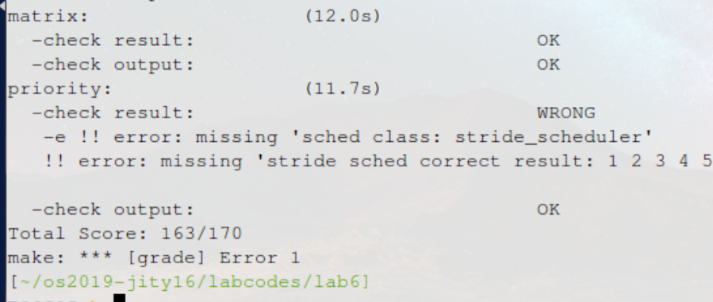
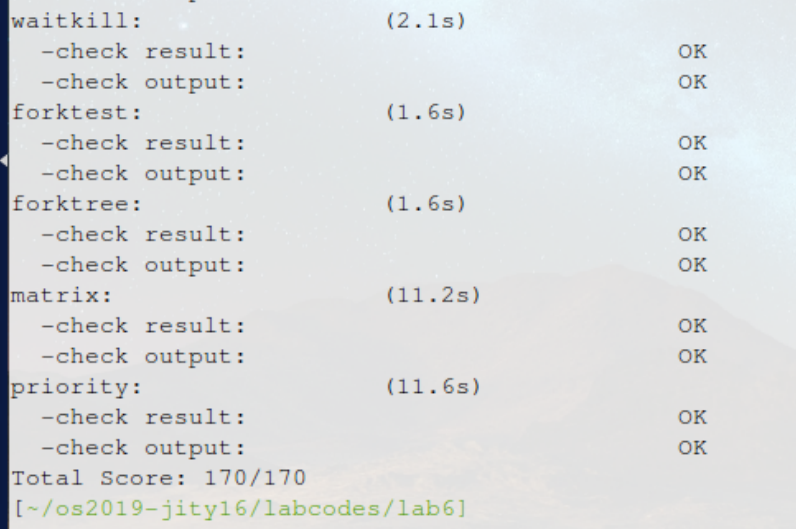

计64	嵇天颖	2016010308

## LAB 6

[TOC]

------

### 练习0：填写已有实验

> 本实验依赖实验`1/2/3/4/5`。请把你做的实验`2/3/4/5`的代码填入本实验中代码中有`“LAB1”/“LAB2”/“LAB3”/“LAB4”“LAB5”`的注释相应部分。并确保编译通过。注意：为了能够正确执行`lab6`的测试应用程序，可能需对已完成的实验`1/2/3/4/5`的代码进行进一步改进。

#### 修改`proc.c`

为了实现调度器算法，在`LAB6`中`proc_struct`中添加了与进程调度相关的几个字段：

~~~c
struct run_queue *rq;              // 运行队列
list_entry_t run_link;             // 该进程的调度链表结构，该结构内部的连接组成了运行队列列表
int time_slice;                    // 该进程剩余的时间片，只对当前进程有效
skew_heap_entry_t lab6_run_pool;   // 该进程在优先队列中的节点
uint32_t lab6_stride;              // 该进程的调度优先级
uint32_t lab6_priority;       	   // 该进程的调度步进值
~~~

因此我们需要在```alloc_proc```中对这几个新的字段进行初始化：

~~~c
proc->rq = NULL;
list_init(&(proc->run_link));
proc->time_slice = 0;
proc->lab6_run_pool.left=proc->lab6_run_pool.right=proc->lab6_run_pool.parent=NULL;
proc->lab6_stride = 0;
proc->lab6_priority = 0;
~~~


#### 修改`trap.c`

在每个时钟中断的时候需要给调度器通知，以更新各种相关的数据。

因此我们在```trap_dispatch```函数中的`case IRQ_OFFSET + IRQ_TIMER:`分支中添加下面一句：

~~~c
ticks++;
        if (ticks % TICK_NUM == 0) {
        }
        sched_class_proc_tick(current);
~~~

---


### 练习1：使用 Round Robin 调度算法

> 完成练习0后，建议大家比较一下（可用`kdiff3`等文件比较软件）个人完成的`lab5`和练习0完成后的刚修改的`lab6`之间的区别，分析了解`lab6`采用`RR`调度算法后的执行过程。

#### 【练习1.1】

> 执行`make grade`，大部分测试用例应该通过。但执行`priority.c`应该过不去。

执行`make grade`结果如下图所示，除`priority`均通过




#### 【练习1.2】

> 请理解并分析`sched_class`中各个函数指针的用法，并结合`Round Robin `调度算法描`ucore`的调度执行过程

**(1)理解并分析`sched_class`中各个函数指针的用法**

为了保证调度器接口的通用性，`ucore`调度框架定义了如下接口`sched_class`，该接口中，几乎所有成员变量均为函数指针。我们首先观察`sched_class`结构体定义：

~~~c
struct sched_class {
    // 调度器的名字
    const char *name;
    // 初始化运行队列
    void (*init)(struct run_queue *rq);
    // 将进程p插入队列rq
    void (*enqueue)(struct run_queue *rq, struct proc_struct *proc);
    // 将进程p从队列rq中删除
    void (*dequeue)(struct run_queue *rq, struct proc_struct *proc);
    // 返回运行队列中下一个可执行的进程
    struct proc_struct *(*pick_next)(struct run_queue *rq);
    // timetick处理函数
    void (*proc_tick)(struct run_queue *rq, struct proc_struct *proc);
};
~~~

**调度器初始化`void (*init)(struct run_queue *rq)`**

调度初始化函数`sched_init`，需要内核初始化过程中调用这个函数，这个函数负责选择调度器并且对选择的调度器进行初始化。

**将进程加入调度器`void (*enqueue)(struct run_queue *rq, struct proc_struct *proc)`**

当进程被唤醒后，需要调用`sched_class_enqueue`将其加入到调度器中。

**进程调度**

调度函数`schedule`变化如下：

- 在切换进程之前调用`sched_class_enqueue`将当前进程加入到RR的调度链表中；
- 调用`sched_class_pick_next`获取RR算法选取的下一个进程；
- 调用`sched_class_dequeue`将即将运行的进程从RR算法调度链表中删除。

**调度器时钟更新`void (*proc_tick)(struct run_queue *rq, struct proc_struct *proc)`**

时间片用完，调用`sched_class_proc_tick`更新调度器中的时钟。


由此我们得知：

`schedule`函数完成了与调度框架和调度算法相关三件事情:把当前继续占用`CPU`执行的运行进程放放入到就绪进程队列中，从就绪进程队列中选择一个“合适”就绪进程，把这个“合适”的就绪进程从就绪进程队列中摘除。

通过调用三个调度类接口函数`sched_class_enqueue、sched_class_pick_next、sched_class_enqueue`来使得完成这三件事情与具体的调度算法无关。

`run_timer_list`函数在每次`timer`中断处理过程中被调用，从而可用来调用调度算法所需的`timer`时间事件感知操作，调整相关进程的进程调度相关的属性值。通过调用调度类接口函数`sched_class_proc_tick`使得此操作与具体调度算法无关。


**(2)结合`Round Robin `调度算法描`ucore`的调度执行过程**

**Round Robin 调度算法**

`RR`调度算法的调度思想 是让所有`runnable`态的进程分时轮流使用CPU时间。RR调度器维护当前`runnable`进程的有序运行队列。当前进程的时间片用完之后，调度器将当前进程放置到运行队列的尾部，再从其头部取出进程进行调度。RR调度算法的就绪队列在组织结构上也是一个双向链表，只是增加了一个成员变量，表明在此就绪进程队列中的最大执行时间片。而且在进程控制块`proc_struct`中增加了一个成员变量`time_slice`，用来记录进程当前的可运行时间片段。

在每个`timer`到时的时候，操作系统会递减当前执行进程的`time_slice`，当`time_slice`为`0`时，就意味着这个进程运行了一段时间（这个时间片段称为进程的时间片），需要把CPU让给其他进程执行，于是操作系统就需要让此进程重新回到`rq`的队列尾，且重置此进程的时间片为就绪队列的成员变量最大时间片`max_time_slice`值，然后再从`rq`的队列头取出一个新的进程执行。


**具体分析**

**（1）分析`RR`与`sched_class`的调用关系**

在实现Round Robin算法的```default_sched.c```中，有如下：

~~~c
struct sched_class default_sched_class = {
    .name = "RR_scheduler",
    .init = RR_init,
    .enqueue = RR_enqueue,
    .dequeue = RR_dequeue,
    .pick_next = RR_pick_next,
    .proc_tick = RR_proc_tick,
};
~~~

在```default_sched.h```中定义了

~~~c
extern struct sched_class default_sched_class;
~~~

因此`sched.c`中就可以使用`sched_class`来调用RR算法的功能。

我们已经知道`sched_class`通用的接口：初始化、入队列，出队列，获取队首，时钟事件。

这里实现的`RR`算法维护了一个就绪进程的队列。每次进行调度的时候，把当前进程（如果还是处于就绪）加入到队列的末尾，然后取出该队列头部的进程（同时从队列中删除），选择其调度执行。如果队列中没有可调度的进程，就选取`idleproc`运行。`wakeup_proc`函数中，也直接将要唤醒的那个进程加入就绪队列的末尾。

**（2）调度节点**

分析uCore的进程调度点，大致分为如下调度点：

- `do_exit`, `do_wait`, `init_main`, `cpu_idle`, `lock`中调用`schedule`函数时由于要执行等待操作或退出操作，如果不放弃CPU使用权是对资源的浪费，属于主动放弃CPU使用权，不涉及调度器规则中的打断；
- `trap`函数中，首先要判断是否中断处于用户态，如果处于用户态且已经被标记为需要调度，则该进程会被主动打断，至于何时被标记需要调度，一部分取决于调度器的设计。


> 请在实验报告中简要说明如何设计实现”多级反馈队列调度算法“，给出概要设计，鼓励给出详细设计

**数据结构**

* 首先需要在运行队列`run_queue`中增加多个队列，比如可以用数组实现：

  ~~~c
  list_entry_t multi_run_list[MULTI_QUEUE_NUM];	//多级队列
  ~~~

* 由于有多个队列，所以我们要增加进程的队列号来进行优先级管理：

  ~~~c
  int multi_level;      //在 proc_struct 中增加进程的队列号                    
  ~~~

**算法分析**

同样的，我们要实现类似于`sched_class`中各个指针函数的功能：

* 初始化所有的运行队列`init`
* 将进程入队`enqueue`：需要根据进程的优先级判断应该加入哪个队列
  - 若进程上一个时间片用完了，降低优先级
  - 将进程加入优先级对应的队列
  - 设置该优先级对应的时间片
  - 增加计数值

* 将进程出队`dequeue`: 从优先级高的队列开始查找，如果为空就往下查找优先级低一级的进程。根据`proc`中保存的信息找到对应的队列进行删除
* 返回运行队列中下一个可执行的进程`pick_next`:按照优先级顺序检查每个队列，如果队列存在进程，那么选择这个进程
* 调度器时钟更新`proc_tick`: 和RR算法一致
* 时间片`time_slice`: 为了实现多种不同的时间片大小，应该在入队的时候给不同优先级的进程设置不同大小的`time_slice`

---


### 练习2：实现 Stride Scheduling 调度算法

> 首先需要换掉RR调度器的实现，即用`default_sched_stride_c`覆盖`default_sched.c`。然后根据此文件和后续文档对`Stride`度器的相关描述，完成`Stride`调度算法的实现。

#### Stride Scheduling 调度算法分析

**(1)原理**

`Stride Scheduling`算法用一个小顶堆选择即将调入`CPU`执行的进程。初始化时，将堆设为空，进程数为0。出现新建进程时，将进程加入堆，并设置时间片和指向堆的指针，增加进程计数。当一个进程执行完毕后将其从堆中移除并减少进程计数。当需要调度时，从堆顶取出当前`stride`值最小的进程调入`CPU`执行，并将其`stride`增加`pass`大小，如果堆顶为空，则返回空指针。产生时钟中断的处理与其他调度算法相同，减少当前进程的执行时间，若剩余时间为0则进行调度。

**（2）实现工作**

将```default_sched_stride_c```覆盖```default_sched.c```后，需要编写的就是几个函数

~~~c
stride_init();
stride_enqueue();
stride_dequeue();
stride_pick_next();
stride_proc_tick();
~~~

即为初始化，入队，出队，返回运行队列中下一个可执行的进程，更新调度器时钟五个操作函数


#### 具体实现过程与分析

设置` BIG_STRIDE`为`0x7FFFFFFF`

~~~c
#define BIG_STRIDE   0x7FFFFFFF /* you should give a value, and is ??? */
~~~

**（1）初始化函数stride_init**

需要对几个变量初始化（根据注释来填写）：

* 初始化调度器类的信息
* 初始化当前的运行队列为一个空的容器结构
* 将进程数目初始化为0

~~~c
static void
stride_init(struct run_queue *rq) {
     /* LAB6: 2016010308 
      * (1) init the ready process list: rq->run_list
      * (2) init the run pool: rq->lab6_run_pool
      * (3) set number of process: rq->proc_num to 0       
      */
    list_init(&(rq->run_list));
    rq->lab6_run_pool = NULL;
    rq->proc_num = 0;
}
~~~


**（2）进程入队函数stride_enqueue**

需要把当前的进程添加到斜堆当中，使用```skew_heap```提供的工具函数```skew_heap_insert```。斜堆中使用的比较函数为```proc_stride_comp_f```，这里使得每次从堆中取出的一定是`stride`最小的进程。

- 将进程插入到优先队列中；
- 更新进程的剩余时间片；
- 设置进程的队列指针；
- 增加进程计数值

~~~c
static void
stride_enqueue(struct run_queue *rq, struct proc_struct *proc) {
     /* LAB6: 2016010308 */
     rq->lab6_run_pool = skew_heap_insert(rq->lab6_run_pool, &(proc->lab6_run_pool),
               proc_stride_comp_f);
     // Clamp time_slice to be valid value
     if (proc->time_slice == 0 || proc->time_slice > rq->max_time_slice) {
         proc->time_slice = rq->max_time_slice;
     }
     proc->rq = rq;
     rq->proc_num += 1;
}
~~~


**（3）进程出队函数stride_dequeue**

- 将进程从优先队列中删除
- 将进程计数值减一

~~~c
static void
stride_dequeue(struct run_queue *rq, struct proc_struct *proc) {
     /* LAB6: 2016010308 */
      rq->lab6_run_pool = skew_heap_remove(rq->lab6_run_pool, &(proc->lab6_run_pool),
               proc_stride_comp_f);
      rq->proc_num -= 1;
}
~~~


**(4) 返回运行队列中下一个可执行的进程函数stride_pick_next**

扫描整个运行队列，返回其中`stride`值最小的对应进程。更新对应进程的`stride`值，即`pass = BIG_STRIDE / P->priority; P->stride += pass`。

- 如果队列为空，返回空指针；
- 从优先队列中获得一个进程（就是指针所指的进程控制块）；
- 更新`stride`值。

~~~c
static struct proc_struct *
stride_pick_next(struct run_queue *rq) {
     /* LAB6: 2016010308 */
  	 if (rq->lab6_run_pool == NULL) return NULL;
     struct proc_struct* min_proc = le2proc(rq->lab6_run_pool, lab6_run_pool);
     if (min_proc->lab6_priority == 0) {
          min_proc->lab6_stride += BIG_STRIDE;
     } else if (min_proc->lab6_priority > BIG_STRIDE) {
          min_proc->lab6_stride += 1;
     } else {
          min_proc->lab6_stride += BIG_STRIDE / min_proc->lab6_priority;
     }
     return min_proc;
}
~~~


**(5)更新调度器时钟函数stride_proc_tick**

检测当前进程是否已用完分配的时间片。如果时间片用完，应该正确设置进程结构的相关标记来引起进程切换。一个 `process` 最多可以连续运行 `rq.max_time_slice`个时间片。

此函数与`RR`调度算法实现一致。

~~~c
static void
stride_proc_tick(struct run_queue *rq, struct proc_struct *proc) {
     /* LAB6: 2016010308 */
    if(proc->time_slice > 0) proc->time_slice --;
    if(proc->time_slice == 0) proc->need_resched = 1;
}
~~~

---


### 与参考答案的区别

应该是有区别的，尝试运行参考答案发现参考答案`make grade`不通过后就没有细看参考答案。好在我们的平台提供的注释非常贴心，就完全翻译注释法来写代码，和注释步骤保持了高度一致。我的`make grade`是都通过的。

---


### 运行结果

执行`make grade`，所有的测例均通过。`make run_priority`与附件中提供的输出也一致。




---


### 知识点列写

#### （1）实验中重要的OS知识点

- 进程调度实现
  * 内核抢占点
  * 进程切换过程
- RR算法：
  * RR调度算法的调度思想 是让所有runnable态的进程分时轮流使用CPU时间。RR调度器维护当前runnable进程的有序运行队列。
- Stride算法
  * round-robin 调度器，在假设所有进程都充分使用了其拥有的 CPU 时间资源的情况下，所有进程得到的 CPU 时间应该是相等的。
  * 但是有时候我们希望调度器能够更智能地为每个进程分配合理的 CPU 资源。假设我们为不同的进程分配不同的优先级，则我们有可能希望每个进程得到的时间资源与他们的优先级成正比关系。Stride调度是基于这种想法的一个较为典型和简单的算法。除了简单易于实现以外，它还有如下的特点：
    * 可控性：如我们之前所希望的，可以证明 Stride Scheduling对进程的调度次数正比于其优先级。
    * 确定性：在不考虑计时器事件的情况下，整个调度机制都是可预知和重现的。
- 调度准则

#### （2）而OS原理中很重要，但在实验中没有对应上的知识点有

- FCFS算法、短进程优先算法等
- 实时调度和多处理器调度
- 优先级反置


