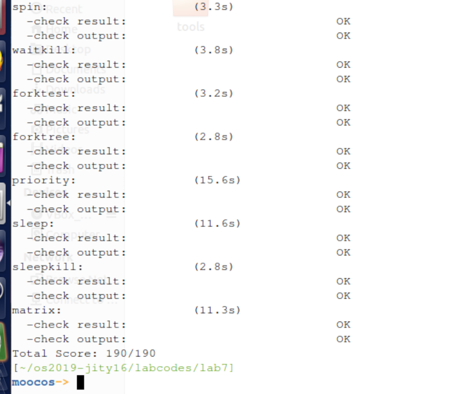

计64	嵇天颖	2016010308

## LAB 7

[TOC]

---

### 练习0：填写已有实验

> 本实验依赖实验`1/2/3/4/5/6`。请把你做的实验`1/2/3/4/5/6`的代码填入本实验中代码中有`“LAB1”/“LAB2”/“LAB3”/“LAB4”/“LAB5”/“LAB6”`的注释相应部分。并确保编译通过。注意：为了能够正确执行lab7的测试应用程序，可能需对已完成的实验`1/2/3/4/5/6`的代码进行进一步改进。

#### 修改`trap.c`

在`trap_dispatch`函数中修改之前对时钟中断的处理，使得`ucore`能够利用定时器提供的功能完成调度和睡眠唤醒等操作因此我们需要在`trap_dispatch`函数中`IRQ_OFFSET + IRQ_TIMER`分支中添加：

```
run_timer_list();
```

与此同时，`lab6`中添加的

```
sched_class_proc_tick(current);
```

已经被添加到`run_timer_list`函数中，故删去。


---

### 练习1: 理解内核级信号量的实现和基于内核级信号量的哲学家就餐问题

#### 【练习1.1】

> 完成练习0后，建议大家比较一下（可用meld等文件diff比较软件）个人完成的lab6和练习0完成后的刚修改的lab7之间的区别，分析了解lab7采用信号量的执行过程。执行`make grade`，大部分测试用例应该通过。

在实验七中的`ucore`初始化过程，开始的执行流程都与实验六相同，直到执行到创建第二个内核线程`init_main`时，修改了`init_main`的具体执行内容，即增加了`check_sync`函数的调用。

进一步分析，可以看到`check_sync`这个函数主要分为了两个部分，第一部分是实现基于信号量的哲学家问题，第二部分是实现基于管程的哲学家问题。

* `check_sync`函数的第一部分：首先实现初始化了一个互斥信号量，然后创建了对应5个哲学家行为的5个信号量，并创建5个内核线程代表5个哲学家，每个内核线程完成了基于信号量的哲学家吃饭睡觉思考行为实现。

* `check_sync`函数的第二部分：首先初始化了管程，然后又创建了5个内核线程代表5个哲学家，每个内核线程要完成基于管程的哲学家吃饭、睡觉、思考的行为实现。


#### 【练习1.2】

> 请在实验报告中给出内核级信号量的设计描述，并说明其大致执行流程。

`Lab7`在`sem.c`和`sem.h`实现了信号量。

信号量是一种同步互斥机制的实现，普遍存在于现在的各种操作系统内核里。相对于`spinlock`的应用对象，信号量的应用对象是在临界区中运行的时间较长的进程。等待信号量的进程需要睡眠来减少占用 CPU 的开销。

##### 基本实现原理

```c
struct semaphore {
int count;
queueType queue;
};
void semWait(semaphore s)
{
s.count--;
if (s.count < 0) {
/* place this process in s.queue */;
/* block this process */;
}
}
void semSignal(semaphore s)
{
s.count++;
if (s.count<= 0) {
/* remove a process P from s.queue */;
/* place process P on ready list */;
}
}
```

基于上诉信号量实现可以认为:

- 当多个`(>1)`进程可以进行互斥或同步合作时，一个进程会由于无法满足信号量设置的某条件而在某一位置停止，直到它接收到一个特定的信号（表明条件满足了）。
- 为了发信号，需要使用一个称作信号量的特殊变量:
  - 为通过信号量`s`传送信号，信号量的`V`操作采用进程可执行原语`semSignal(s)`；
  - 为通过信号量`s`接收信号，信号量的`P`操作采用进程可执行原语`semWait(s)`；
  - 如果相应的信号仍然没有发送，则进程被阻塞或睡眠，直到发送完为止。

`ucore`中信号量参照上述原理描述，建立在开关中断机制和`wait_queue`的基础上进行了具体实现。


##### 数据结构

`semaphore_t`是最基本的记录型信号量（`record semaphore`)结构，包含了用于计数的整数值`value`，和一个进程等待队列`wait_queue`，一个等待的进程会挂在此等待队列上。

```c
typedef struct {
    int value;		//信号量的当前值
    wait_queue_t wait_queue;	//信号量对应的等待队列
} semaphore_t;
```


##### 功能函数

在`ucore`中最重要的信号量操作是`P`操作函数`down(semaphore_t *sem)`和`V`操作函数 `up(semaphore_t *sem)`。

但这两个函数的具体实现是`_down(semaphore_t *sem, uint32_t wait_state) `函数和`_up(semaphore_t *sem, uint32_t wait_state)`函数，

~~~c
void sem_init(semaphore_t *sem, int value);		//初始化函数
void up(semaphore_t *sem);						//V操作函数
void down(semaphore_t *sem);					//P操作函数
bool try_down(semaphore_t *sem);
~~~


##### 函数分析

信号量的实现主要关注`up`和`down`两个函数。在`sem.c`中实现的这两个函数分别调用`_up`和`_down`来实现具体的功能。传入的`WT_KSEM`作为设置的`wait_state`，表示等待的是内核信号量。以下分别对`_down`和`_up`两个函数进行分析。

**__down函数**

为了保证操作的原子性而不被打断，`up`和`down`操作都需要在进入函数之后关闭中断，在退出函数之前再次打开中断。

`down`操作需要先检查`value`的值是否大于零：

* 若`value`的值大于0，表示还有资源可用，故将`value`的值减1，直接返回即可。

  ~~~c
  // 如果资源还有剩余，则信号量值减一，可以正常访问资源
      if (sem->value > 0) {
          sem->value --;
          local_intr_restore(intr_flag);
          return 0;
      }
  ~~~

* 若不大于零，就说明该信号量对应的资源已经分配完了，故需要进行等待。

  ```c
  // 资源没有剩余，需要将当前进程加入信号量的等待队列，
  wait_t __wait, *wait = &__wait;
  wait_current_set(&(sem->wait_queue), wait, wait_state);
  local_intr_restore(intr_flag);
  ```

  这里表示对该进程新建一个wait变量，然后将其加入该信号量的等待队列中。

  之后调用schedule函数，调度其他处于就绪态的进程执行。

  ~~~c
  //并重新调度
  schedule();
  ~~~

  该进程从等待状态被唤醒，重新开始执行时，再从信号量的等待队列里面将其删除。

  ~~~c
  // 阻塞完毕，该进程被重新唤醒调度，说明现在可以使用该资源了。
  // assert(sem->value == 0); // !IMPORTANT
  local_intr_save(intr_flag);
  wait_current_del(&(sem->wait_queue), wait);
  local_intr_restore(intr_flag);
  
  if (wait->wakeup_flags != wait_state) {
      return wait->wakeup_flags;
  }
  ~~~


**__up函数**

与`_down`一样，需要在进入时关闭中断，在退出时打开中断。执行`_up`函数的时候需要从该信号量的等待队列里面取出一个进程唤醒。

* 如果信号量对应的`wait queue`中没有进程在等待，直接把信号量的`value`加一，然后开中断返回

* 如果有进程在等待且进程等待的原因是`semophore`设置的，则调用`wakeup_wait`函数将`waitqueue`中等待的第一个`wait`删除，且把此`wait`关联的进程唤醒，最后开中断返回。

  ~~~c
  void up(semaphore_t *sem, uint32_t wait_state) {
      bool intr_flag;
      // 在进行up操作（即V操作）的时候，需要由操作系统保证其原子性
      local_intr_save(intr_flag);
      {
          wait_t *wait;
          // 当没有进程希望占用该资源的时候，资源释放
          if ((wait = wait_queue_first(&(sem->wait_queue))) == NULL) {
              sem->value ++;
          }
          else {
              // 有进程希望占用此资源，现在这个资源被释放了一份，所以应该唤醒下一个希望占用该资源的进程
              assert(wait->proc->wait_state == wait_state);
              wakeup_wait(&(sem->wait_queue), wait, wait_state, 1);
          }
      }
      local_intr_restore(intr_flag);
  }
  ~~~


##### 大致执行流程

所有哲学家共享临界区信号量`mutex`，这个信号量用于保证哲学家线程在操作`state_sema`数组时不产生冲突，因此在`take_forks`和`put_forks`函数里都需要加锁。另外，使用`s`信号量数组表示每个哲学家是否正在占用他盘子左面和右面的两个叉子的资源正在进餐，当尝试开始进餐的时候，哲学家会试图取得两个叉子：如果不能取得，则使用`s`信号量进入阻塞状态。而只有当其他的哲学家进餐完毕之后，才会去检查周围的哲学家是否能够进餐，如果可以进餐，则解除`s`信号量引起的阻塞。

这种同步互斥的方式与原理课上所讲解的3种实现方式均不一样，但是同样具有正确性。但`ucore`中信号量的实现和原理课中的实现是不同的。在原理课信号量的实现中，`value`可以小于`0`，小于`0`多少就表示有多少个进程在等待。而在`ucore`的实现中，`value`不能小于`0`。

所以，如果执行`_down`的时候`value`已经为`0`，就不减少`value`的值，而是直接加入等待队列中。进而在`_up`中也需要进行修改，只有当等待队列为空的时候才增加`value`的值。


#### 【练习1.3】

> 请在实验报告中给出给用户态进程/线程提供信号量机制的设计方案，并比较说明给内核级提供信号量机制的异同。

由于操作系统需要保持`PV`操作的原子性，必须使用特权指令禁用中断。由于CLI和STI指令是特权指令，故在用户态中不能关闭中断来保证若干条操作的原子性。

由于用户进程的切换是由操作系统控制的，如果某用户进程在执行`_up`和`_down`操作的过程中被操作系统打断，改为由其他进程执行，就有可能出现错误。因此，关键是如何在用户态保证`_up`和`_down`操作的原子性。

**软件方法**：我们可以用纯软件的方法，保证这种原子性。原理课中所讲的`Peterson`算法和`Dekker`算法就是用来解决这一问题的。

**自旋锁**：我们可以借助`CPU`提供的原子指令实现自旋锁。设置一个位变量用来标识一个锁，然后通过`CPU`提供的原子指令，保证获取这个锁的进程才能进入临界区进行信号量的相关操作。

**区别**：用户态和内核态实现信号量的区别主要在于控制临界区访问的方法的不同。


---

### 练习2: 完成内核级条件变量和基于内核级条件变量的哲学家就餐问题（需要编码）

> 首先掌握管程机制，然后基于信号量实现完成条件变量实现，然后用管程机制实现哲学家就餐问题的解决方案（基于条件变量）。

#### 【练习2.1】

> 请在实验报告中给出内核级条件变量的设计描述，并说明其大致执行流程。

##### 设计描述

该内容的实现主要包括两部分，管程机制的建立，以及使用条件变量实现哲学家问题。

**`cond_signal`函数**

首先进程判断`cv.count`:

* 如果不大于0，则表示当前没有执行`cond_wait`而睡眠的进程，函数退出；

* 如果大于0，这表示当前有执行`cond_wait`而睡眠的进程A，因此需要唤醒等待在`cv.sem`上睡眠的进程A。

  由于只允许一个进程在管程中执行，所以一旦进程B唤醒了别人（进程A），那么自己就需要睡眠。故让`monitor.next_count`加一，且让自己（进程B）睡在信号量`monitor.next`上。如果睡醒了，这让`monitor.next_count`减一。

~~~c
void 
cond_signal (condvar_t *cvp) {
   //LAB7 EXERCISE1: 2016010308
   cprintf("cond_signal begin: cvp %x, cvp->count %d, cvp->owner->next_count %d\n", cvp, cvp->count, cvp->owner->next_count);  
   // 执行了signal操作，需要观察是否有进程等在该条件变量上
   monitor_t* mtp = cvp->owner;
   if (cvp-> count > 0){
   		// 如果有，则需要转而执行等待的进程
     	// 将自己放在特殊的next里面，保证那个进程执行完毕或是wait的时候能切回自己。
        mtp->next_count ++;
        // 唤醒所有等待的进程，让他们执行。
        up(&(cvp->sem));
        // 自己阻塞
        down(&(mtp->next));
        mtp->next_count --;
   }
   cprintf("cond_signal end: cvp %x, cvp->count %d, cvp->owner->next_count %d\n", cvp, cvp->count, cvp->owner->next_count);
}
~~~


**`cond_wait`函数**

* 如果调用了`cond_wait`函数，那么当前等待该条件的睡眠进程个数`count`加一。

* 如果`next_count`大于0，说明有大于等于1个进程执行`cond_signal`且睡着了，所以唤醒`mtp`的`next`信号量，然后进程睡在`cv.sem`上，如果睡醒了，则让`cv.count`减一，表示等待此条件的睡眠进程个数少了一个，

* 如果`next_count`小于等于0，表示目前没有进程执行`cond_signal`函数且睡着了，那需要唤醒的是由于互斥条件限制而无法进入管程的进程，所以要唤醒睡在`monitor.mutex`上的进程。然后进程A睡在`cv.sem`上，如果睡醒了，则让`cv.count`减一，表示等待此条件的睡眠进程个数少了一个，可继续执行了。

~~~c
void
cond_wait (condvar_t *cvp) {
    //LAB7 EXERCISE1: 2016010308
    cprintf("cond_wait begin:  cvp %x, cvp->count %d, cvp->owner->next_count %d\n", cvp, cvp->count, cvp->owner->next_count);
    // 等待队列长度加1
    cvp->count ++;
    // 需要将自己换出，让出管程
    // 但是需要特别判断是否存在next优先进程。
    monitor_t* mtp = cvp->owner;
    if(mtp->next_count > 0){
       up(&(mtp->next));
    }else{
       up(&(mtp->mutex));
    }
    // 自己阻塞
    down(&(cvp->sem));
    cvp->count --;
    cprintf("cond_wait end:  cvp %x, cvp->count %d, cvp->owner->next_count %d\n", cvp, cvp->count, cvp->owner->next_count);
}
~~~


**`take_forks`函数**

在管程中，通过`phi_test_condvar`来检测旁边的两个哲学家都没有在就餐，以此来进行叉子的获取。如果没有成功获取的话，就会`wait`在自己对应的条件变量上。

当哲学家开始时，首先设置状态为`HUNGRY`，之后检测是否满足他的条件，如果不满足的话一直对条件变量进行`wait`操作。

~~~c
void phi_take_forks_condvar(int i) {
     down(&(mtp->mutex));	//通过P操作进入临界区
//--------into routine in monitor--------------
     // LAB7 EXERCISE1: 2016010308
     // I am hungry
     state_condvar[i] = HUNGRY;		//记录下哲学家i是否饥饿，即处于等待状态拿叉子
     // try to get fork
     phi_test_condvar(i);
     while (state_condvar[i] != EATING) {
       cond_wait(&(mtp->cv[i]));	//如果得不到叉子就睡眠
     }
   /*......*/
}
~~~


**`put_forks`函数**

在`phi_put_forks_condvar`中归还两把叉子并通知左右两边两个哲学家检查是否可以开始就餐，如果可以就将其唤醒。

哲学家放下筷子时，将他的状态设置为`THINKING`，同时`test`它左右两个人的状态。

~~~c
void phi_put_forks_condvar(int i) {
     down(&(mtp->mutex));	//通过P操作进入临界区

//--------into routine in monitor--------------
     // LAB7 EXERCISE1: 2016010308
     // I ate over
     state_condvar[i]=THINKING;	//记录进餐结束的状态
     // test left and right neighbors
     phi_test_condvar(LEFT);	//看一下左边哲学家现在是否能进餐
     phi_test_condvar(RIGHT);	//看一下右边哲学家现在是否能进餐
    /*......*/
}
~~~


##### 执行流程

初始化时设置管程中有`N`个条件变量（对应`N`个哲学家）。

需要实现的有`phi_take_forks_condvar`和`phi_put_forks_condvar`(这两个函数详细说明见**设计描述**部分)。这两个函数都是在管程当中，在进入时需要获取管程访问权，退出时需要释放管程访问。

内核态的管程机制采用`Hoare`管程实现：

* 每次进入管程获取管程的锁：

  ~~~c
  down(&(mtp->mutex));
  ~~~

* 退出的时候释放管程的锁，或者如果在管程中有进程处于阻塞等待，唤醒其运行而不释放管程锁：

  ~~~c
  if(mtp->next_count>0)
     up(&(mtp->next));
  else
     up(&(mtp->mutex));
  ~~~

才能使得管程机制正常工作。这两句实际上相当于原理课上所讲的`lock->Acquire()`和`lock->Release()`操作。使得进入管程取得共享资源的仅有一个进程。

在成功进入管程之后，就需要条件变量来进行更细致的同步互斥控制了。条件变量的定义如下：

```c
typedef struct condvar{
    semaphore_t sem;
    int count;
    monitor_t * owner;
} condvar_t;
```

`sem`为条件变量提供了`wait`和`signal`的接口。而`owner`则代表了该条件变量所处的管程，由于管程实现的是`Hoare`管程，这就要求`T1`和`T2`之间的切换不被`T3`打断，且在`T2`执行了`signal`操作之后应该立即切换到`wait`的`T1`继续执行。这个时候等待的`T2`并没有像`Mesa`管程一样重新进入了相应条件变量的等待队列，而是优先地等在`next`变量上，等待如下的解锁时机继续运行：变量名`next`存储在管程中，代表了由于执行`signal`操作而进入睡眠状态的锁，解锁时机为*另一个进程退出或另一个进程`wait`。

条件变量和管程分别用`condvar`和`monitor`两个结构实现。等待条件变量和通知条件变量的变化用`cond_wait`和`cond_signal`两个函数完成。这些在前面**设计描述**部分已经进行了详细地说明。


#### 【练习2.2】

> 请在实验报告中给出给用户态进程/线程提供条件变量机制的设计方案，并比较说明给内核级提供条件变量机制的异同。

**相同点**：用户态条件变量机制与内核态实现基本一致，即由一个变量的操作来判断当前资源的使用情况，需要系统原子操作的支持，通过系统调用在用户态实现管程的处理函数。

**不同点**：

- 内核态信号量可以直接调用内核的服务，而用户态信号量需要通过系统调用接口调用内核态的服务，涉及到栈切换等等。
- 内核态信号量存储在内核态的内核栈上，而用户态信号量存储在内核中一段共享内存中。

**设计方案**：

用户态进程、线程的信号量机制依旧需要内核态的信号量机制支持，因此在内核部分沿用上面给出的内核态信号量实现。

`cond_signal`和`cond_wait`导致的进程阻塞与唤醒都可以由信号量的相关接口进行完成，因此我们可以设计用户态的管程机制，由语言内部维护或是用户手动维护这两个必要函数的运作，通过系统调用完成对信号量的`PV`操作。

我们可以参考`posix`信号量机制：`posix`为可移植的操作系统接口标准。信号量的概念在`system v `和`posix `中都有，但是它们两者的具体作用是有区别的。`system v`版本的信号量用于实现进程间的通信，而`posix`版本的信号量主要用于实现线程之间的通信，两者的主要区别在于信号量和共享内存。

我们可以模仿`posix`的信号量，提供对有命名的和无命名的信号量的支持来实现。

（1）有命名的信号量一般用于进程同步，使用文件进行关联，该部分的信号量是随着内核而存在的。

命名信号量通常用于不共享内存的情况下。

类似的我们可以增加接口：`sem_open,sem_close,sem_unlink`.

（2）无命名的信号量一般用于线程的同步，当进程终止时，它也就消亡了。

 无名信号量下的通信机制属于共享内存的情况，可以实现进程中多个线程之间的同步与互斥。

类似的我们可以增加接口`sem_init`,`sem_destory`,`sem_wait,sem_post`.


> 请在实验报告中回答：能否不用基于信号量机制来完成条件变量？如果不能，请给出理由，如果能，请给出设计说明和具体实现。

能够不基于信号量机制来实现条件变量，但是需要有一个锁机制保证每次对等待队列的增删操作以及等待个数修改的操作是互斥的，即`cond_signal`,` cond_wait`函数前后需要加一个互斥锁。


### 实验结果

**make grade 通过**




## 与参考答案的区别

- 练习2：平台给出的注释步骤很详尽，因此基本实现思路与答案相同，偶有部分细节差异。

  

## 实验中的重要知识点

#### 本次实验中重要的知识点有：

- 同步互斥机制的底层支持

  * 计时器
  * 屏蔽与使能中断
  * 等待队列

- 信号量

  信号量是一种同步互斥机制的实现，普遍存在于现在的各种操作系统内核里。相对于`spinlock `的应用对象，信号量的应用对象是在临界区中运行的时间较长的进程。等待信号量的进程需要睡眠来减少占用` CPU `的开销。

- 管程和条件变量

  引入了管程是为了将对共享资源的所有访问及其所需要的同步操作集中并封装起来。`Hansan`为管程所下的定义：“一个管程定义了一个数据结构和能为并发进程所执行（在该数据结构上）的一组操作，这组操作能同步进程和改变管程中的数据”。有上述定义可知，管程由四部分组成：

  - 管程内部的共享变量；
  - 管程内部的条件变量；
  - 管程内部并发执行的进程；
  - 对局部于管程内部的共享数据设置初始值的语句。

  局限在管程中的数据结构，只能被局限在管程的操作过程所访问，任何管程之外的操作过程都不能访问它；另一方面，局限在管程中的操作过程也主要访问管程内的数据结构。由此可见，管程相当于一个隔离区，它把共享变量和对它进行操作的若干个过程围了起来，所有进程要访问临界资源时，都必须经过管程才能进入，而管程每次只允许一个进程进入管程，从而需要确保进程之间互斥。但在管程中仅仅有互斥操作是不够用的。进程可能需要等待某个条件Cond为真才能继续执行。

- 哲学家就餐问题

#### OS原理中很重要，但在实验中没有对应上的知识点有：

- 使用原子指令实现同步互斥
- 生产者-消费者问题