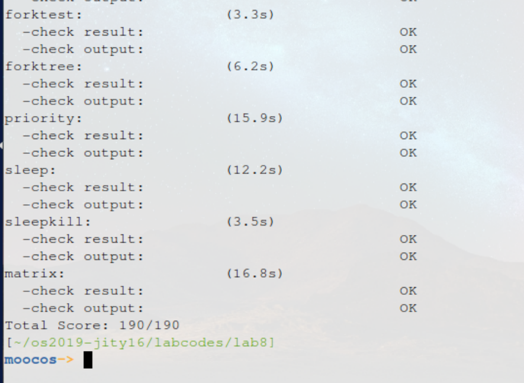

计64	嵇天颖	2016010308

## LAB 8

[TOC]

---

### 练习0：填写已有实验

> 本实验依赖实验`1/2/3/4/5/6/7`。请把你做的实验`1/2/3/4/5/6/7`的代码填入本实验中代码中有`“LAB1”/“LAB2”/“LAB3”/“LAB4”/“LAB5”/“LAB6” /“LAB7”`的注释相应部分。并确保编译通过。注意：为了能够正确执行`lab8`的测试应用程序，可能需对已完成的实验`1/2/3/4/5/6/7`的代码进行进一步改进。

只需要依次将实验`1-7`的代码填入本实验中代码即可，无需进行其他的修改

---


### 练习1: 完成读文件操作的实现（需要编码）

#### 【练习1.1】

> 首先了解打开文件的处理流程，然后参考本实验后续的文件读写操作的过程分析，编写在`sfs_inode.c`中`sfs_io_nolock`读文件中数据的实现代码。

##### （1）打开文件的处理流程

**文件访问接口层**：在`sh.c`文件中，由`main`函数可以看出 这是一个单独的测试文件系统的文件，通过`main->reopen->open->sys_open->syscall`系统调用进入内核态，之后通过终端处理例程，调用`sys_open->sysfile_open`。

**文件系统抽象层**：通过`file_open`分配了一个空闲的`file`数据结构，`file_open`函数通过调用`vfs_open`和参数`path`来找到文件对应的`inode`结构的`vfs`索引节点， 而`vfs_open`函数调用了`vfs_lookup`函数找到`path`对应的`inode`数据结构，并调用`vop_open`函数打开文件。 

总体调用顺序为:

~~~c
file_open->vfs_open->vfs_lookup(vop_open)
~~~

`vfs_lookup`函数是一个针对目录的操作函数，需要通过`path`找到目标文件首先要 找 到根 目录` ”/”`， 然后又由接下 来的调用`vfs_lookup->vop_lookup->get_device->vfs_get_bootfs `找到根目录`”/”`对应的`inode`数据结构`node`，然`fs_lookup`会调用`vop_lookup`找到对应文件的索引节点。找到索引节点之后，再调用宏定义`vop_open`打开文件。

**实现文件的打开**：

* 先处理起始处没有对齐到块的部分，再以块为单位循环处理中间部分，最后处理末尾剩余部分；
* 每部分的处理都调用`sfs_bmap_load_nolock`函数得到`blkno`对应的`inode`编号，并调用`sfs_rbuf`或`sfs_rblock`函数读取数据（中间部分调用`sfs_rblock`，起始和末尾部分调用`sfs_rbuf`），调整相关变量即可。


##### （2）读文件实现分析

在实现过程中，主要修改的是`sfs_io_nolock`的代码，该函数的功能是给定一个文件的`inode`以及需要读写的偏移量和大小，转换成数据块级别的读写操作。主要调用的是两个函数：

- `sfs_bmap_load_nolock`: 该函数能够将文件数据块的便宜转换成硬盘空间块的数据块编号；
- `sfs_block_op` / `sfs_buff_op`：该函数接受硬盘空间数据块编号，并进行读写操作；

当然，用户希望读取的文件大小和偏移并非是和数据块一一对齐的，因此在边界情况的时候需要特殊处理，这也是这个实验的要点所在，需要判断偏移的开头未对齐部分和结尾未对齐部分专门进行处理，而中间部分则调用对齐的`block`级别操作进行处理。

实际上，跟踪函数`sfs_buff_op`的调用可以得知：该函数在进行设备操作的时候也是以块为单位的。如果要读取一个块内的小部分数据，就必须将数据块整体读出或整体写入。文件操作都是以块为单位来进行的。`ucore`中文件块的大小和内存页的大小一致`（4kB）`。在对一定长度的文件区域进行读写的时候，一般来讲会将读写的区域分成三块：

* 开始位置可能不从某个块的开头开始

* 中间部分的完成的若干块

* 结尾部分不以块的末尾作为结束

在这里的实现里面也同样的对这样的三个部分进行处理。每个部分都执行一些基本的操作。

首先是根据文件系统和文件inode的结构体查询到要进行操作的块在磁盘上的块号

~~~c
sfs_bmap_load_nolock(sfs, sin, blkno, &ino)
~~~

返回的ino就是我们需要的磁盘块号。之后进行的读写操作都基于这个号来进行。然后对于整块的读写或者是块中某一个小部分的读写，分别使用两个不同的方法来进行：

```
sfs_block_op(sfs, buf, ino, 1)
```

```
sfs_buf_op(sfs, buf, size, ino, blkoff)
```

需要注意着两个是函数指针，在之前分别根据是读还是写指向了具体的操作函数。


##### 具体代码

~~~c
if ((blkoff = offset % SFS_BLKSIZE) != 0) {	//读取第一部分的数据
        size = (nblks != 0) ? (SFS_BLKSIZE - blkoff) : (endpos - offset);	//计算第一个数据块的大小
        if ((ret = sfs_bmap_load_nolock(sfs, sin, blkno, &ino)) != 0) {	//找到内存文件索引对应的block的编号
            goto out;
        }
        if ((ret = sfs_buf_op(sfs, buf, size, ino, blkoff)) != 0) {
            goto out;
        }
    	//完成实际的读写操作
        alen += size;
        if (nblks == 0) {
            goto out;
        }
        buf += size;
        blkno++;
        nblks--;
    }
	//读取中间部分的数据，将其分为size大学的块，然后一次读一块直至读完
    size = SFS_BLKSIZE;
    while (nblks != 0) {
        if ((ret = sfs_bmap_load_nolock(sfs, sin, blkno, &ino)) != 0) {
            goto out;
        }
        if ((ret = sfs_block_op(sfs, buf, ino, 1)) != 0) {
            goto out;
        }
        alen += size;
        buf += size;
        blkno++;
        nblks--;
    }
	//读取第三部分的数据
    if ((size = endpos % SFS_BLKSIZE) != 0) {
        if ((ret = sfs_bmap_load_nolock(sfs, sin, blkno, &ino)) != 0) {
            goto out;
        }
        if ((ret = sfs_buf_op(sfs, buf, size, ino, 0)) != 0) {
            goto out;
        }
        alen += size;
    }
~~~


#### 【练习1.2】

> 请在实验报告中给出设计实现”UNIX的PIPE机制“的概要设方案，鼓励给出详细设计方案

管道是进程间通信的一个基础设施，管道缓存了其输入端所接受的数据，以便在管道输出端读的进程能以一个先进先出的方式来接收数据。

管程是由内核管理的一个缓冲区，一个缓冲区不需要很大，它被设计成为环形的数据结构，以便管道可以被循环利用。当管道中没有信息的话，从管道中读取的进程会等待，直到另一端的进程放入信息。当管道被放满信息的时候，尝试放入信息的进程会等待，直到另一端的进程取出信息。当两个进程都终结的时候，管道也自动消失。

实现的时候需要建立一个虚拟的设备，在内存中放置一个缓冲区，在fork进程的时候将其`stdin`和`stdout`两个设备文件正确地设置为指向该设备。其他具体的实现可以参考已有的`stdin`和`stdout`两个设备，包括合适的设置缓冲，以及等待输入时候的阻塞等待。

在`Linux`中，管道的实现并没有使用专门的数据结构，而是借助了文件系统的file结构和`VFS`的索引节点`inode`。通过将两个` file` 结构指向同一个临时的 `VFS `索引节点，而这个` VFS`索引节点又指向一个物理页面而实现的。

---


### 练习2: 完成基于文件系统的执行程序机制的实现（需要编码）

#### 【练习2.1】

> 改写`proc.c`中的`load_icode`函数和其他相关函数，实现基于文件系统的执行程序机制。执行：`make qemu`。如果能看看到`sh`用户程序的执行界面，则基本成功了。如果在`sh`用户界面上可以执行`”ls”,”hello”`等其他放置在`sfs`文件系统中的其他执行程序，则可以认为本实验基本成功。

`proc.c`中需要做如下修改：

**alloc_proc()函数**

增加对于`filesp`内容的初始化:

~~~c
proc->filesp = NULL;
~~~

**do_fork()函数**

增加对于`filesp`的复制处理，直接调用实现好的函数即可：

~~~c
 if (copy_files(clone_flags, proc) != 0) {
        goto bad_fork_cleanup_fs;
 }
~~~

**load_icode()函数**

* 为新进程创建`mm`和`PDT`
* 调用`load_icode_read`加载`elf`格式文件，并进行`magic_number`的判断
* 对于每一个程序段如下完成操作：
  * `load_icode_read`加载程序起始段，创建`vma`，分配内存，读入程序段
  * 进行堆栈分配，设置`mm`，`cr3`等寄存器，并将`argc`和`argv`的值放入栈中，设置`trapframe`

~~~c
assert(argc >= 0 && argc <= EXEC_MAX_ARG_NUM);
//(1)建立内存管理器
if (current->mm != NULL) {	//要求当前内存管理器为空
    panic("load_icode: current->mm must be empty.\n");
}

int ret = -E_NO_MEM;	// E_NO_MEM代表因为存储设备产生的请求错误
struct mm_struct *mm;	//建立内存管理器
if ((mm = mm_create()) == NULL) {
    goto bad_mm;
}
//(2)建立页目录
if (setup_pgdir(mm) != 0) {
    goto bad_pgdir_cleanup_mm;
}
struct Page *page;	//建立页表

//(3)从文件加载程序到内存
struct elfhdr __elf, *elf = &__elf;
if ((ret = load_icode_read(fd, elf, sizeof(struct elfhdr), 0)) != 0) {
    goto bad_elf_cleanup_pgdir;
}

if (elf->e_magic != ELF_MAGIC) {
    ret = -E_INVAL_ELF;
    goto bad_elf_cleanup_pgdir;
}

struct proghdr __ph, *ph = &__ph;
uint32_t vm_flags, perm, phnum;

struct proghdr *ph_end = ph + elf->e_phnum;
for (phnum = 0; phnum < elf->e_phnum; phnum ++) {
    off_t phoff = elf->e_phoff + sizeof(struct proghdr) * phnum;
    if ((ret = load_icode_read(fd, ph, sizeof(struct proghdr), phoff)) != 0) {
        goto bad_cleanup_mmap;
    }
    if (ph->p_type != ELF_PT_LOAD) {
        continue ;
    }
    if (ph->p_filesz > ph->p_memsz) {
        ret = -E_INVAL_ELF;
        goto bad_cleanup_mmap;
    }
    if (ph->p_filesz == 0) {
        continue ;
    }

    vm_flags = 0, perm = PTE_U;		//建立虚拟地址与物理地址之间的映射
    if (ph->p_flags & ELF_PF_X) vm_flags |= VM_EXEC;
    if (ph->p_flags & ELF_PF_W) vm_flags |= VM_WRITE;
    if (ph->p_flags & ELF_PF_R) vm_flags |= VM_READ;
    if (vm_flags & VM_WRITE) perm |= PTE_W;
    if ((ret = mm_map(mm, ph->p_va, ph->p_memsz, vm_flags, NULL)) != 0) {
        goto bad_cleanup_mmap;
    }
    off_t offset = ph->p_offset;
    size_t off, size;
    uintptr_t start = ph->p_va, end, la = ROUNDDOWN(start, PGSIZE);

    ret = -E_NO_MEM;

    //复制数据段和代码段
    end = ph->p_va + ph->p_filesz;	 //计算数据段和代码段终止地址
    while (start < end) {
        if ((page = pgdir_alloc_page(mm->pgdir, la, perm)) == NULL) {
            ret = -E_NO_MEM;
            goto bad_cleanup_mmap;
        }
        off = start - la, size = PGSIZE - off, la += PGSIZE;
        if (end < la) {
            size -= la - end;
        }
        //每次读取size大小的块，直至全部读完
        if ((ret = load_icode_read(fd, page2kva(page) + off, size, offset)) != 0) {
            goto bad_cleanup_mmap;
        }
        start += size, offset += size;
    }

    //建立BSS段
    end = ph->p_va + ph->p_memsz;	//同样计算终止地址
    if (start < la) {
        if (start == end) {
            continue ;
        }
        off = start + PGSIZE - la, size = PGSIZE - off;
        if (end < la) {
            size -= la - end;
        }
        memset(page2kva(page) + off, 0, size);
        start += size;
        assert((end < la && start == end) || (end >= la && start == la));
    }
    while (start < end) {
        if ((page = pgdir_alloc_page(mm->pgdir, la, perm)) == NULL) {
            ret = -E_NO_MEM;
            goto bad_cleanup_mmap;
        }
        off = start - la, size = PGSIZE - off, la += PGSIZE;
        if (end < la) {
            size -= la - end;
        }
        //每次操作size大小的块
        memset(page2kva(page) + off, 0, size);
        start += size;
    }
}
sysfile_close(fd);	//关闭文件，加载程序结束

//(4)建立相应的虚拟内存映射表
vm_flags = VM_READ | VM_WRITE | VM_STACK;
if ((ret = mm_map(mm, USTACKTOP - USTACKSIZE, USTACKSIZE, vm_flags, NULL)) != 0) {
    goto bad_cleanup_mmap;
}
assert(pgdir_alloc_page(mm->pgdir, USTACKTOP-PGSIZE , PTE_USER) != NULL);
assert(pgdir_alloc_page(mm->pgdir, USTACKTOP-2*PGSIZE , PTE_USER) != NULL);
assert(pgdir_alloc_page(mm->pgdir, USTACKTOP-3*PGSIZE , PTE_USER) != NULL);
assert(pgdir_alloc_page(mm->pgdir, USTACKTOP-4*PGSIZE , PTE_USER) != NULL);

//(5)设置用户栈
mm_count_inc(mm);
current->mm = mm;
current->cr3 = PADDR(mm->pgdir);
lcr3(PADDR(mm->pgdir));

//setup argc, argv
uint32_t argv_size=0, i;
for (i = 0; i < argc; i ++) {
    //i = 0;
    //while(i <argc){
    argv_size += strnlen(kargv[i],EXEC_MAX_ARG_LEN + 1)+1;
    //i ++;
}
//(6)处理用户栈中传入的参数，其中argc对应参数个数，uargv[]对应参数的具体内容的地址
uintptr_t stacktop = USTACKTOP - (argv_size/sizeof(long)+1)*sizeof(long);
char** uargv=(char **)(stacktop  - argc * sizeof(char *));

argv_size = 0;
for (i = 0; i < argc; i ++) {
    uargv[i] = strcpy((char *)(stacktop + argv_size ), kargv[i]);
    argv_size +=  strnlen(kargv[i],EXEC_MAX_ARG_LEN + 1)+1;
}

stacktop = (uintptr_t)uargv - sizeof(int);	 //计算当前用户栈顶
*(int *)stacktop = argc;

//(7)设置进程的中断帧   
struct trapframe *tf = current->tf;
memset(tf, 0, sizeof(struct trapframe));	//初始化tf，设置中断帧
tf->tf_cs = USER_CS;
tf->tf_ds = tf->tf_es = tf->tf_ss = USER_DS;
tf->tf_esp = stacktop;
tf->tf_eip = elf->e_entry;
tf->tf_eflags = FL_IF;
ret = 0;
//(8)错误处理部分
out:
	return ret;	 //返回
bad_cleanup_mmap:
	exit_mmap(mm);
bad_elf_cleanup_pgdir:
	put_pgdir(mm);
bad_pgdir_cleanup_mm:
	mm_destroy(mm);
bad_mm:
    goto out;
~~~

`load_icode`主要是将文件加载到内存中执行，根据注释的提示分为了一共七个步骤：

* 建立内存管理器
* 建立页目录
* 将文件逐个段加载到内存中，这里要注意设置虚拟地址与物理地址之间的映射
* 建立相应的虚拟内存映射表
* 建立并初始化用户堆栈
* 处理用户栈中传入的参数
* 最后很关键的一步是设置用户进程的中断帧

还需要一旦发生错误进行错误处理。


#### 【练习2.2】

> 请在实验报告中给出设计实现基于”`UNIX`的硬链接和软链接机制“的概要设方案，鼓励给出详细设计方案

硬软链接都应该在文件系统层面上实现，即`ucore`里的`Simple File System`，并储存在硬盘中。

**硬链接**：硬链接中不同的文件对应同一个磁盘`inode`。`ucore`中已经实现了硬链接。在

~~~c
struct sfs_disk_entry {
    uint32_t ino;                                   /* inode number */
    char name[SFS_MAX_FNAME_LEN + 1];               /* file name */
};
~~~

这个结构体是每个目录包含的文件的`entry`项。硬链接的方式是不同的文件的`entry`使用相同的`ino number`，即实际上对应磁盘上相同的`inode`。同时在磁盘`inode`的结构体中`nlinks`表示有多少个文件链接到了这个同一个`inode`。当删除文件是递减这个计数，当减为`0`是将该文件`inode`本身删除。

**软链接**：软链接实际上就是一个快捷方式，一个文件指向了另一个文件名。软链接的实现稍微复杂些，需要在`inode`上增加标记位确认这个文件是普通文件还是软链接文件，在进行打开文件或是保存文件的时候，操作系统需要根据软链接指向的地址再次在文件目录中进行查询，寻找或创建相应的`inode`，注意与硬链接不同，创建软链接的时候不涉及对`nlinks`的修改。如果需要创建软链接这个特殊的文件，也需要增加一个系统调用（例如`SYS_symlink`）在完成相应的功能。

---


### 实验结果



---


### 与参考答案的区别

是按照注释来写的，应该和参考答案思路一致。

---


### 实验中的重要知识点

#### 本次实验中重要的知识点有：

- 文件系统和文件
- 文件描述符
- 文件、目录的定义与区别
- 虚拟文件系统对上层提供的接口以及实现

#### OS原理中很重要，但在实验中没有对应上的知识点有：

- 冗余磁盘阵列RAID
- 文件分配
- I/O子系统的相关控制